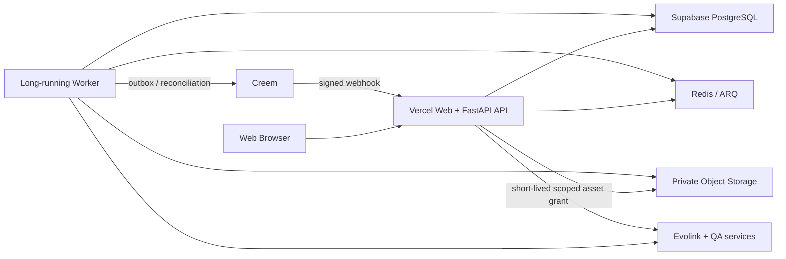

# VowPic 海外 Web 商业闭环与生产验收设计

> **历史决策记录，不是当前执行权威。** 当前运行拓扑以 `docs/ARCHITECTURE.md` 为准，当前有限生产收口以 `docs/operations/vowpic-finite-production-closure-plan.md` 为准。本文中的 Redis/ARQ、独立 Worker、Railway、Worker digest/heartbeat 和 runtime drain 设计均已被网站 FastAPI 后端直连 EvoLink、PostgreSQL 租约/对账及认证订单推进方案取代。

> 状态：2026-07-10 已批准设计的历史归档；不再是当前设计或执行权威。
>
> 日期：2026-07-10
>
> 实施状态：尚未开始修改生产代码。

> 2026-07-23 执行修订：上面的实施状态和本文后续拓扑是 2026-07-10 的历史快照。当前实现状态以代码、`docs/PRD.md`、`docs/ARCHITECTURE.md`、有限生产收口计划和生产证据为准。EvoLink 只是由 VowPic FastAPI 网站后端调用的生图 API；提交前持久化、`SUBMITTING/UNKNOWN`、PostgreSQL lease/fencing、回调关联、已认证订单进度 POST 和受保护人工恢复 POST 负责恢复与对账。当前 Production 不构建或部署独立 Worker 镜像，不使用 Railway，也不把 Redis/ARQ 或 Vercel Cron 作为生成前提。Creem 退款、订阅和取消仅以 Test Mode 签名事件与账本事实进入自动 Preview 验收。旧文中与此修订冲突的 Worker、Redis/ARQ 生成队列、runtime drain、双部署、Provider 合同激活、网络故障注入和伪 dispatch 动作均已废止。

## 1. 决策摘要

VowPic 的目标产品是面向海外用户的 Web SaaS，不是微信产品，也不包含微信小程序。本段以下内容记录 2026-07-10 当时的历史方案；凡涉及 Redis/ARQ、独立 Worker 或 Railway 的描述均已被文首修订取代，不得用于当前实现或验收。

本文是一份统一验收的 umbrella spec，不是一份可以原子执行的单任务计划。后续实施计划必须按本文七个阶段拆成有先后依赖、独立退出门和回滚点的工作包；“一步到位”指最终只接受完整商业闭环，不表示把身份、存储、支付、队列、QA、前端和迁移塞进一次部署。只有全部强制门禁通过、达到 `Production accepted` 后，才能报告“规划已经完整实现”。

核心决策如下：

1. 产品只构建和验收海外 Web SaaS；删除微信、小程序、OpenID 和 `wx_*` 身份语义。
2. 公开账户只使用 Supabase Google OAuth，业务后端签发短期、可撤销的本地会话。
3. 上传、订单、积分、支付、生成、下载全部要求可信身份；匿名标识只用于统计和风控。
4. 用户图片全部进入私有存储；业务数据只保存 artifact ID 和 private object key，不保存永久公开 URL。
5. 订单、积分预留、生成任务和 Outbox 在同一数据库事务中落库。
6. Redis/ARQ 只负责唤醒和调度，PostgreSQL 中的 job/attempt/lease 才是任务状态权威。
7. QA、修复、水印和最终交付全部 fail-closed；任何错误都不能降级交付未验证原图。
8. Creem 的支付、退款、部分退款和争议必须与不可变积分账本闭环。
9. CI 先用 Preview 验证同一 commit 的集成行为，再创建使用生产环境变量且不自动绑定域名的 staged Production deployment；验收该生产制品后无重建 Promote，并核对完整 release bundle。
10. 前端围绕真实用户任务重组，补齐组件测试、浏览器 E2E、响应式和 WCAG 2.2 AA 基线。
11. 高风险功能先关闭，只有对应的真实证据存在后才逐项重开。

用户已确认设计与本文的对应关系：

| 已确认设计节 | 本文落点 |
| --- | --- |
| 1. 保留架构、四个边界、固定顺序 | 第 4、5 节 |
| 2. 海外 Web-only、Google 身份、私有上传 | 第 6、7 节 |
| 3. 交易、积分、支付、持久任务 | 第 8、9 节 |
| 4. 生成、QA、修复、交付、保留 | 第 10、11、14 节 |
| 5. CI、staged Production、release bundle 验收 | 第 15、18 节 |
| 6. 用户主链路、无障碍、组件拆分 | 第 12、13 节 |
| 7. 迁移、重开、文档和完成定义 | 第 16、17、19、20、21 节 |

## 2. 当前证据基线

以下判断来自 2026-07-10 对当前工作树、测试、CI、生产只读探针和现有 artifact 的审计。它们是设计输入，不代表实施已经完成。

### 2.1 已确认事实

- 权威后端入口是 `backend/app/main.py`，业务接口挂在 `/api/v1`。
- 当前代码已经包含真实的 PostgreSQL/SQLAlchemy 订单、不可变积分账本、Creem checkout/webhook、Evolink 生成、QA、存储和清理代码。
- 当前有效图像生成方向是 Evolink；生产图像生成必须收敛为 Evolink 唯一路径，Wenwen/ComfyUI 图像生成、fallback model、Live Portrait workflow 和隐式派发都要删除。Wenwen 仅可在独立类型边界内作为文本/视觉 QA LLM，不能实现图像生成接口。
- Google OAuth 和 Supabase token 交换已经存在于 `backend/app/routers/auth/google.py` 和 `frontend/src/utils/supabase.ts`。
- `backend/app/core/user_auth.py` 仍会信任 `X-User-OpenID` 和 `X-Visitor-Id`，`backend/app/routers/auth/guest.py` 会把任意 Web code 哈希成 `wx_*` 用户。
- `frontend/package.json`、`frontend/src/manifest.json` 和 `frontend/src/utils/auth/session.ts` 仍包含微信小程序构建或运行分支。
- 上传接口未要求普通用户身份，只信任声明 MIME；批量上传会静默跳过失败项。
- 当前订单把 source/preview/final 公共 URL 直接存入 JSONB；存储实现仍包含 `public-read` 和 public Blob。
- 当前 QA 存在视觉服务失败后仍完成订单的路径，LLM 结果存在 `bool("false") == True` 类严格类型缺口。
- 当前水印失败会把原始结果作为免费预览返回。
- 当前订单和积分先提交、任务后派发，没有事务 Outbox；当前配置还允许同步内联生成。
- 当前一次性购买的退款/争议没有完整积分冲正；checkout 外部副作用发生在本地提交前。
- 当前清理失败后可能先丢失 URL，导致对象无法继续重试删除。
- `frontend/src/pages/preview/preview.vue`、`create/index.vue`、首页、Admin 首页和 `PaymentModal.vue` 均超过 900 行，其中多个超过 1000 行。
- 当前 CI 只执行后端 unittest 和前端 build；token 缺失时 deploy job 仍可成功，production smoke 不校验部署 SHA，也不覆盖真实商业主链。
- 审计时后端 193 个测试有 1 个 error；前端 `vue-tsc` 因版本组合失败；没有前端测试门。
- 2026-05-20 的两个源图对象在 2026-07-10 仍可公开读取，超过当前公开的 7 天源图保留承诺。

### 2.2 尚未验证事实

以下内容不能写成“已通过”，必须由实施阶段产生新鲜证据：

- 当前生产部署对应的 commit SHA、数据库 revision 和 Worker 版本。
- 生产 Google 登录、会话刷新和注销。
- 生产数据库中 legacy guest/password/openid 用户的数量、冲突和资产归属。
- Evolink 是否支持客户端幂等键或按关联 ID 对账。
- 真实 PostgreSQL 并发预留、真实 Redis/ARQ 崩溃恢复和真实私有存储删除。
- Creem test mode 的一次性购买、订阅、退款、部分退款和 dispute 全流程，以及生产环境经批准的低额购买、全额退款和订阅路径。
- 当前版本的真实单人、本地双人、金婚和 Web 邀请合拍质量。
- 当前部署区域、各数据处理方的实际区域和跨服务数据流。
- 法律文本是否已经由合格法律专业人员审核。

## 3. 目标、范围和非目标

### 3.1 本次目标

- 修复已确认的 P0/P1 安全、身份、交易、任务、QA、存储、留存、CI 和 UX 缺口。
- 让普通海外 Web 用户真实完成：Google 登录、上传、生成、预览、购买、私密下载、删除和订单查询。
- 让 Web 邀请合拍在完成身份、权限和双浏览器 E2E 后重新开放。
- 建立单一、受版本控制、可追踪的产品与工程权威文档。
- 建立三层证据账本：PR 质量门、真实集成/Preview 门、生产验收门。

### 3.2 明确非目标

- 不支持微信登录、微信公众号或微信小程序。
- 不保留游客生成、密码账户公开入口或 OpenID 业务身份。
- 不更换 FastAPI、Vue/Uni-app Web 构建链、PostgreSQL、Redis/ARQ、Creem 或当前生成 Provider。
- 不建立多 Provider 自动降级；生产配置只允许一个明确的图像生成主 Provider。
- 不重写成 `/v2`，不另起前后端项目。
- 不引入新的 UI 框架或视觉风格重做。
- 不用 Admin Probe、mock、静态 artifact 或旧截图代替普通用户真实链路。
- Live Portrait、本地影楼推荐和任何没有真实 Provider/真实商家数据的入口不属于本次商业发布；它们必须从公开 UI 和当前 PRD 中移除或保持关闭，不能用占位数据冒充完成。
- 本次可以让隐私、退款和条款与实际代码一致，但不宣称获得任何地区的法律合规认证。

## 4. 架构与四个责任边界



Vercel 只承载 Web 静态产物和短时 API。生成、轮询、QA、修复、对账和恢复运行在独立的长运行 Worker 上。Worker 继续使用仓库已有的 Redis/ARQ 与 PostgreSQL，不引入新的队列供应商。

### 4.1 身份与输入边界

权威数据：Supabase Google subject、本地 user ID、本地 session、用户拥有的 media asset。

允许职责：OAuth、会话、授权、上传验证、图片重编码、素材所有权、Gatekeeper 和受限 Partner Invite。

禁止职责：相信自报 OpenID/visitor header、接受普通用户公网 URL、让匿名标识拥有订单/积分/文件、在输入失败时创建订单。

失败语义：401/403/4xx 快速失败，不创建订单、不预留积分、不产生 Provider 副作用。

### 4.2 交易与任务边界

权威数据：订单、定价快照、credit reservation、不可变 ledger、purchase/payment event、generation job、outbox。

允许职责：幂等建单、预留、扣除、释放、退款、任务投递、租约和恢复。

禁止职责：在数据库提交前调用外部 Provider、直接改写历史账本、把 Redis 当唯一任务状态、吞掉未知支付状态。

失败语义：数据库事务整体回滚；已提交但尚未入 Redis 的任务由 Outbox 恢复；未知外部状态停止自动重提。

### 4.3 生成与交付边界

权威数据：generation attempt、private artifact、不可变 QA verdict、保留政策和删除状态。

允许职责：Provider 调用、候选转存、两阶段 QA、最多两次修复、水印、私密下载和实际删除。

禁止职责：直接返回 Provider URL、QA 异常判通过、水印失败返回原图、把未验证候选标为 READY。

失败语义：保留私有证据、按错误分类重试；达到上限后 FAILED 并自动退款，不交付残次图。

### 4.4 发布证据边界

权威身份分成两级。部署前先计算 role-discriminated `runtime_bundle_id`：`SAFE_BASELINE` 只绑定 Tasks 1-4 source/schema/all-OFF contract/tool；`PREVIEW_IDENTITY` 绑定 exact source、当前 schema/migration set、身份/会话/flag/Preview contract，不需要 Worker；`PREVIEW_COMMERCIAL` 绑定 exact source、当前 schema、payload/Provider/model/catalog/flag/gate/activation contract 与 CI 构建的 digest-pinned ephemeral Preview Worker；`COMMERCIAL_7A` 绑定同类 Production contracts 与获批 Worker digest；`CONTRACT_7B` 还绑定 `schema_before/schema_target`、contract migration checksum 和兼容版本。每个角色都进入不同 domain separator，Preview ID 不能冒充 Production ID。runtime ID 明确排除 Vercel deployment ID、API build output、resolved snapshots、实时状态、evidence 和最终 manifest hash，因此可在部署前注入对应 API/Worker/job/flag 运行时。

部署后才封存不可回写的 manifest/report。`PREVIEW_IDENTITY` 与 `PREVIEW_COMMERCIAL` 各自生成 role-tagged、create-once 的 Preview activation report，CAS 绑定 exact source/runtime/API deployment，commercial variant 还绑定 ephemeral Worker digest/run；它们只授权 `environment=preview` 的短期 cohort，cleanup 后进入不可逆 `CLEANED`，禁止被 Production resolver、Promote 或 release acceptance 接受。Production final manifest 至少包含 Production runtime ID、final source SHA、可重复 prebuilt checksum、对应 Preview evidence hash、真实 API/Worker deployment ID、7a 的不同 private-compatible baseline/staged target、schema contract、payload compatibility、Provider/model/catalog/flag contract、pre-activation OFF snapshot 和预期最终 snapshot。manifest 采用 canonical JSON、content-addressed create-once Private evidence object；`ReleaseActivation` 以 CAS 绑定 runtime ID、manifest/report SHA、角色/部署 ID 和阶段。未注册或不匹配部署只能暴露 liveness/version/运维 readiness，所有非 OFF 副作用 fail-closed。实时 flag、migration、验收、观察和 final decision 是绑定 manifest hash 的 append-only evidence entry，不冒充制品，也不回写 manifest。

任何只应执行一次、成功后可能丢失响应且不能仅凭调用方 workspace 恢复的外部效果，都必须先持久化 create-once intent，再以稳定 intent ID 执行并由新 runner 查询/核对/清理。常规托管 Worker 不具备安全、精确地丢弃某一次第三方 TLS 响应的宿主机原语，因此 Production 禁止创建 response-drop 规则、fault intent 或 tombstone。Evolink 响应丢失恢复必须在隔离的 Preview/Sandbox 中以真实请求完成，测试传输边界只丢弃调用方响应，并由签名回调、关联查询和数据库事实证明同一 Provider task、单次 submit、单次 capture；Production 只接受与 exact source SHA 绑定的 VERIFIED Provider contract evidence。

允许职责：构建、测试、Preview 集成、staged Production 验收、无重建 Promote、生产探针、人工成片复核和成套回滚。

禁止职责：build 冒充功能完成、旧部署冒充新部署、脚本打印失败却 exit 0、Admin Probe 冒充用户流程。

失败语义：任一强制 gate 为 `FAIL` 或 `NOT_RUN`，整体 release 必须失败。

## 5. 固定实施顺序和阶段退出门

这是一个项目，但必须按下列顺序实施。每一阶段都要附带相关测试，不能把所有测试推迟到第五阶段。

| 阶段 | 实施内容 | 退出门 | 回滚点 |
| --- | --- | --- | --- |
| 1 | 建立支持 kill switch 的安全基线；临时关闭高风险入口；固化权威规格；生产数据只读盘点；数据库备份与恢复演练；在首次安全基线构建前生成 Python 3.11 的 hash-locked API/测试依赖 | 安全基线部署已验证；功能开关生效；盘点报告存在；恢复演练成功；相同输入可重复解析出相同依赖锁 | 只能回到已验证的安全基线，不能回到不支持 kill switch 的原始旧部署 |
| 2 | Web-only、PKCE Google Auth、本地会话、上传/SSRF/TLS、私有存储、严格 QA schema、水印 fail-closed | 冒充、跨用户、恶意图片、QA 异常和水印泄漏测试通过；私有存储真实探针通过 | 关闭上传/生成；回到只读浏览和登录 |
| 3 | checkout 提交顺序、Creem 状态机、退款/争议/欠额、retention/deletion 重试 | 真实 PostgreSQL 并发、重复 webhook、退款/争议和删除重试通过 | 关闭 checkout；保留账本，只使用补偿交易 |
| 4 | Outbox、job/attempt、ARQ Worker、lease/heartbeat/fencing、未知外部状态对账 | 崩溃窗口、重复投递、过期租约、Worker 重启和未知提交测试通过 | 停止 dispatcher/Worker；不删除 job/outbox 记录 |
| 5 | 修复现有红灯；补齐后端集成、OpenAPI/前端测试工具链、版本化 gate contract、受保护 Preview workflow 基础、共享 typed transport，以及 code-versioned Provider contract；在 Stage 6 前必须用官方合同与真实 Evolink sandbox 证明 lost-response 幂等/可查询 correlation，并建立只暴露 token grant path 的 exact Preview grant origin | 所有基础 PR gate 为 PASS；Google session/private media 的真实 Preview 子链可执行且失败清理可证明；`EVOLINK_SUBMISSION_RECONCILIATION=VERIFIED` 绑定签名 sandbox evidence；Preview grant origin/edge rule 可独立清理并恢复原快照；未实现的后续业务 case 明确 NOT_RUN，不能伪装 PASS | 不创建 staged Production deployment；关闭 Preview grant origin并恢复 flags/callback/origin 快照 |
| 6 | 前端主链路、Partner Invite 双浏览器 E2E、响应式、无障碍、组件拆分、当前文档重写，并把对应 mandatory case 接入 Stage 5 已存在的 workflow | 375/768/1024/1440 浏览器、键盘和视觉回归通过；真实 Preview sandbox 主链必须完成 Creem test-mode checkout、Provider 签名 webhook、purchase/grant/reservation/order lineage、预览购买解锁和私密下载，Partner Invite case 必须由真实 paid grant 支付并完成双浏览器权限证明；不得 seed、直接加积分、伪造 webhook 或复用无关 grant | 保持 API 可用，回滚前端部署 |
| 7a | 全部代码/迁移/验收/provider addendum 先提交并冻结 final SHA；同一 build 创建独立 private-compatible baseline 与 staged target；受保护地执行 `0014→0020`、排空旧 writer、backfill/私有对象切换、baseline 正式验证、staged cohort、target 无重建 Promote；旧公共 URL 双地域失效后才逐项 ON；短任务持续采样满 24 小时/cleanup 周期 | immutable bundle 与 append-only activation/evidence 一致；真实主链、观察阈值、全量核对和独立 rollback baseline 演练 PASS；旧公共 URL 失效；状态仅为 `7a release accepted`，满足 7b 前置条件 | 将正式域名回指 manifest 中独立的 private-compatible baseline deployment，并同步回退 Worker image/flags |
| 7b | 在独立后续 release 中执行 destructive contract cleanup、post-contract 回归和最终验收 | Contract migration、post-contract mandatory gates、前向修复预案和最终 Production acceptance 全部 PASS | Contract 前可回滚兼容 bundle；contract 后只允许前向修复/补偿 |

7a 和 7b 是第七阶段的两个独立生产 release，禁止在首次开放流量的 deployment 中执行 destructive contract。任何阶段失败都停在该阶段；不能跳过失败门继续开放下游功能。

## 6. Web-only 与身份会话设计

### 6.1 Web-only 清理

以下内容必须从活跃代码、依赖、CI 和正式文档中删除：

- `dev:mp-weixin`、`build:mp-weixin`。
- `@dcloudio/uni-mp-weixin` 及 lockfile 依赖。
- `manifest.json` 的 `mp-weixin` 配置。
- 所有 `MP-WEIXIN`、`provider: 'weixin'`、`mp_path` 和微信二维码语义。
- `wx_*` 身份前缀、WeChat payment 注释和公共 API 中的 `openid` 字段。
- README/PRD/验收中“Web/小程序”或小程序 E2E 描述。

Uni-app 仅作为现有 Vue Web 构建工具保留；`h5` 只表示其固定编译目标，不是产品形态。默认语言为英语，中文作为可选语言。

旧业务实现可以删除，但本规格要求永久 retired 的公共路径必须由一个集中、无数据库查询、无序列化和无副作用的 tombstone router 明确返回 HTTP 410；删除旧 router 不能把明确的 retired 合同静默变成 404。该 router 只保存路径与统一错误合同，不得反向导入旧 auth/session/Live Portrait/recommendation/lead 服务。

### 6.2 Google OAuth 与本地会话

认证流程固定为：

1. 浏览器先向业务后端创建至少 128-bit、绑定同一浏览器/return path 的一次性 app login intent；10 分钟过期且只能消费一次。该 intent 用于防止 callback/session 被跨浏览器或跨流程复用，不冒充 Supabase/Google 内部 OAuth state。
2. 同一浏览器使用 Supabase Google OAuth Authorization Code + PKCE 发起登录；Supabase Auth 负责 OAuth state、Google OIDC nonce、PKCE verifier/challenge 和一次性 code exchange。callback 不得使用 implicit URL fragment token，code 必须在发起流程的同一浏览器内交换。
3. 后端验证 Supabase JWT 的 issuer、audience、签名、`exp/iat`、`session_id`、subject、`is_anonymous=false`、AMR/provider 确实为 Google，以及 email verification 状态，并把该 Supabase session 绑定并消费 app login intent。Google nonce 属于 Supabase broker 的验证边界；只有 Supabase 同时提供可独立验证的 Google ID token 时，后端才再次验证 Google nonce，不能在没有该 token 时声称已二次验证。
4. 后端只按 `(auth_provider='supabase', auth_subject=<subject>)` 映射本地 user ID，不能只按 email 自动合并。
5. 后端创建 `auth_sessions`，签发 15 分钟本地 access JWT 和 30 天旋转 refresh session。JWT 必须包含 `sid`、`jti`、`token_version`、`iat` 和 `exp`。
6. 生产只采用 Cookie 模式：access JWT 使用 `HttpOnly; Secure; SameSite=Lax` cookie；refresh token 只以哈希形式落库，并放在限定 `/api/v1/auth/refresh` 路径的 `HttpOnly; Secure; SameSite=Strict` cookie 中。前端不接收或持久化 bearer token。
7. 所有状态变更请求必须同时通过 SameSite、Origin 和 CSRF token 校验。
8. 每个受保护请求按 `sid/token_version` 检查 `auth_sessions` 未撤销、未过期并与当前 user 一致；Admin role 从数据库读取，不能只相信 JWT claim。
9. refresh 每次使用后旋转；重用旧 refresh token 会撤销整个 session family 并记录风险事件。
10. logout、用户停用、管理员撤销或 session 到期后，本地会话立即失效。

正式环境通常只接受精确正式 Web origin/callback。staged Production 首次 Google 登录只能临时增加一个由受信 Vercel system metadata 与已注册 ReleaseActivation 推导的精确 `https://<deployment>/auth/callback`；受保护最小权限角色先记录原 allowlist hash，再 add/read-back，验收成功、失败或取消都由独立 finally job remove/read-back。禁止 `*.vercel.app`、globstar、Host/Forwarded/caller 输入或项目自定义变量自授权；残留 staged callback 阻止后续 release。

生产业务接口只能接受本地 JWT/session。Supabase token 只用于初次交换和重新认证，不能与本地 JWT 长期混用。

本地 access/refresh Cookie 都是 HttpOnly；access 只发往 `/api/v1`，refresh 只发往 `/api/v1/auth/refresh`。double-submit CSRF Cookie 必须是 Secure/SameSite、非 HttpOnly 且 `Path=/`，让 `/create`、`/account` 等真实 Web 页面能读取并回送 `X-CSRF-Token`；服务端仍按 session 内 hash、精确 Origin 和 constant-time comparison 校验。refresh rotation 同时轮换 CSRF 值，旧值立即失效。禁止把 raw CSRF 放进 URL、localStorage 或持久业务状态。

浏览器不得继续把 JWT 放进 local storage。`X-User-OpenID` 必须删除；`X-Visitor-Id` 仅可用于匿名统计、限流和风险分析，不能进入所有权判断。

### 6.3 旧账户迁移

迁移前必须盘点 guest、password、admin、`wx_*`、`visitor_*`、无 `auth_subject`、重复 email/subject 和存在资产的 legacy 用户。`users.email` 降级为非权威 profile 字段并取消身份用途的全局唯一约束；新增 `user_identities(provider, subject)` 唯一身份表和 email conflict/claim 记录。相同 email 的 Google canonical user 与 legacy user 可以并存，直到完成受控认领。

- 无订单、积分、支付、订阅或 asset 的 legacy 账户可以在盘点后清理。
- 旧 JWT 只能帮助定位候选 legacy 账户，不能单独证明所有权。任何有资产/权益的合并都必须同时具备当前 Google session，以及可验证支付记录或人工客服账户证据。
- 合并使用 `UNIQUE(legacy_user_id)` 的 `user_account_merges`；要求 legacy != canonical，legacy 不能再次作为 canonical/merge target，禁止链、环和二次合并，并发只能成功一次。
- 可变的所有权记录（订单、asset、invite 和当前 subscription entitlement）在事务中改绑到 canonical user。
- 不可变的 ledger、payment event、purchase、risk 和 audit 历史不得重写 owner；它们通过 merge record 继续关联原始主体。可用积分使用唯一 `ACCOUNT_MERGE_OUT/ACCOUNT_MERGE_IN` 补偿账目转移并把 legacy balance 归零。
- 合并后的只读财务/审计查询通过 merge record 纳入 legacy history；所有新订单、grant、purchase 和 session 只写 canonical user ID。
- 每个可证明来源的 grant lot 保留原 purchase/subscription transaction 和 merge lineage；后续 refund/dispute 必须沿 lineage 冲正 canonical balance。只有真实无法证明来源的余额才进入 `legacy_pool`。
- visitor ID、guest ID 或 email 字符串本身不能认领资产。
- 旧 token 使用 `iat` cutoff/token version 逐步失效；迁移窗口关闭后 `/auth/login` 和 password 公共入口返回明确的 retired 错误。
- `users.openid` 在回滚窗口内保留为只读 legacy alias，活跃代码/RLS/API 全部停止依赖后才在 contract migration 中删除。

identity backfill 的处置固定为 `NORMALIZED | MERGED | SOFT_CLOSED_TOMBSTONED | QUARANTINED_BLOCKING`。所有可登录/活跃 canonical user 必须恰有一个 normalized identity；仅保留历史财务/审计的 guest/password/orphan 用户撤销 session、软关闭并写 tombstone/claim lineage，不伪造 Google identity。仍持有 active asset、open money/reconciliation、nonterminal job 或可认领账户的冲突必须保持 blocking quarantine，不能绕过 7b。`users.username` 仅可保留为非权威 profile，不能用于登录；`openid/unionid/auth_provider/auth_subject/password` 在 zero-reference contract 后删除。

7a/7b 的 `app_current_user_id()` 都使用受限 `SECURITY DEFINER`：non-login owner、`SET search_path = pg_catalog, public`、严格验证 JWT provider/subject、无动态 SQL、`REVOKE ALL FROM PUBLIC`，只向 authenticated role 授 EXECUTE；普通角色无权直接 SELECT `user_identities`。7a 先 normalized identity、后只读 legacy fallback 并计数；7b 在 fallback 连续为零后切为 identity-only，再 drop legacy 字段。真实 PostgreSQL 必须验证 own-row、cross-user denial、direct-table denial、malicious search_path 和 service role。

### 6.4 Admin 与服务身份

- Web Admin 必须使用 Google 账户和数据库 role；不能使用 `X-Admin-Token` 作为浏览器登录方式。
- cron、Worker 和 reconciliation 使用独立、最小权限的 service credential。
- 所有 Admin 写操作写入不可变 audit log，记录 actor、action、target、request ID 和时间，但不记录原图、token 或支付凭证。

### 6.5 Web/API 安全基线

- 生产 Web 与 API 使用同源部署；CORS 只允许精确正式域名，以及上文已注册、未过期的单个 staged validation origin，不使用 `*`、后缀匹配或 caller Host 推导。
- 启用 HSTS、`X-Content-Type-Options: nosniff`、严格 Referrer Policy、最小 Permissions Policy 和与实际资源兼容的 CSP。
- Cookie-auth 状态变更接口必须校验 Origin/CSRF；GET/HEAD 不产生业务写副作用。
- PostgreSQL/Supabase 连接必须使用受信 CA、`CERT_REQUIRED` 和 hostname verification；禁止 `sslmode=require` 最终落到 `CERT_NONE`。所有 Provider/Storage HTTPS client 同样不得关闭证书验证。
- 用户错误统一为 `{code, message, request_id, retryable, field_errors}`；禁止把 `str(exception)`、内部路径、SQL、object key 或 Provider 原始响应直接返回前端。

## 7. 上传、SSRF 与私有素材设计

### 7.1 上传合同

- 上传、批量上传、删除和 Gatekeeper 都要求可信 user/session。
- 上传硬限制使用明确配置：`UPLOAD_MAX_BYTES=10485760`（10 MiB/文件）、`UPLOAD_MAX_FILES=5`、`UPLOAD_MAX_PIXELS=40000000`、`UPLOAD_REQUESTS_PER_HOUR=20`、`UPLOAD_BYTES_PER_DAY=209715200`（200 MiB/用户）、`UPLOAD_MAX_CONCURRENT=2`。生产可以调低，不能调高而不重新完成安全验收。
- 只接受 JPEG、PNG、WebP；服务端必须校验魔数并使用 Pillow/OpenCV 实际解码。
- 默认像素上限为 40 MP；图片炸弹、截断图、异常 ICC/EXIF 和超限尺寸快速失败。
- 接收后清除 EXIF/定位信息，重新编码为安全的 JPEG/WebP，再写入私有存储。
- 客户端 filename 和 MIME 只作提示，不进入 object key 或安全判断。
- 多文件请求中任一文件失败，整批失败并回滚已写对象；禁止部分成功 200。响应通过 `field_errors` 标出每个失败文件，前端逐文件显示原因。
- 返回 `asset_id`、宽高、MIME、大小和过期时间，不返回永久 URL。

上传必须先创建带确定性 object key 的 batch/upload intent 和 `PENDING_UPLOAD` media asset，再写对象；全部对象校验成功后在一个事务中激活整批。崩溃、部分写入或激活失败时先标记 `UPLOAD_FAILED`，再由 stale-intent/orphan-prefix 对账任务把它 CAS 为 `PENDING_DELETE` 并重试删除，不能用一个字段同时表示两个状态，也不能留下没有 owner/expires_at 的私有孤儿对象。

### 7.2 普通素材引用

订单、Gatekeeper 和生成接口只接受当前用户拥有的 `asset_id`。后端从数据库解析 private object key；普通用户不能提交任意 `http(s)` URL。

输入 Gatekeeper 必须读取该 private asset 并使用严格 schema。安全/视觉 Provider 超时、响应缺字段、类型错误或不可用时，输入不能通过，也不能继续创建订单或预留积分。本地亮度/清晰度检查不能替代缺失的安全与人脸判断。

Provider 需要读取源图时，后端创建 32-byte 高熵、单对象、不可枚举的 asset grant。`PROVIDER_ASSET_GRANT_TTL_SECONDS=600`、`PROVIDER_ASSET_GRANT_MAX_READS=3`；grant 绑定 asset、job、provider、用途和过期时间，由受控读取路由流式交付，任务终止或到期后立即撤销。Provider URL 不写入订单、日志或前端响应。

### 7.3 Admin 外部 URL Probe

如确需外部 URL，只能放在独立 Admin Probe：

- 仅允许 HTTPS（显式开发环境除外）。
- 只允许端口 443；`EXTERNAL_FETCH_MAX_REDIRECTS=2`、`EXTERNAL_FETCH_CONNECT_TIMEOUT_SECONDS=5`、`EXTERNAL_FETCH_TOTAL_TIMEOUT_SECONDS=30`、`EXTERNAL_FETCH_MAX_BYTES=10485760`，同时限制声明大小和实际流式下载大小。
- 每次 DNS 解析和每次重定向都阻止 loopback、private、link-local、multicast、metadata 和保留地址。
- TLS 必须验证主机名和证书；数据库连接同样不得再使用 `CERT_NONE`。
- Probe 结果不能作为生产用户验收证据。

### 7.4 私有 artifact 数据模型

新增 `media_assets` 作为图片和视频权威记录，至少包含：

- `id`、`owner_user_id`、`order_id`、`job_id`、`parent_asset_id`。
- `role`：source、intermediate、candidate、qa_input、preview_watermarked、final_master、delivery_variant、legacy_video。
- `storage_provider`、`object_key`、`sha256`、`mime_type`、`byte_size`、`width`、`height`。
- `access_level`、`policy_version`、`expires_at`。
- `status`：PENDING_UPLOAD、UPLOAD_FAILED、ACTIVE、PENDING_DELETE、DELETE_FAILED、DELETED、QUARANTINED。
- `delete_attempts`、`next_delete_at`、`last_delete_error`、`deleted_at`。

数据库不得保存短期签名 URL。用户/订单删除不得级联丢失尚未完成删除的 object key；删除 tombstone 必须保留到存储确认 404/410。

新用户数据表必须有 RLS/服务层所有权规则；outbox、job lease 和 deletion queue 只允许 service role 访问。

## 8. 订单、积分与支付设计

### 8.1 免费预览与付费解锁合同

- 每个经过验证的 `(auth_provider, auth_subject)` 只获得一次 `WELCOME_BONUS=2`，数据库唯一幂等；设备、visitor ID 和重复 Google 登录不能重复领取。
- welcome credits 只允许一次成功的 base single-subject 试用，不允许 couple、Partner Invite、Golden Anniversary、Director/premium scene。失败且没有交付物时退回 welcome credits并允许重试；`TRIAL_MAX_ATTEMPTS_PER_24H=3`，一旦有 READY trial 后终身不再获得免费 trial。
- trial 交付只有一个 3:4、最大 900x1125 的低分辨率水印 preview；private final master 保持锁定。
- 其他生成在提交前必须有足额 spendable credits；不足时先展示 checkout，不创建订单。
- 已付费生成交付一个 3:4 final master 和六个固定 variants：2:3、3:2、3:4、4:5、9:16、1:1。每个 variant 都必须通过实际下载、解码、尺寸和授权测试。
- 用户购买有效 credit pack 或订阅后，可通过幂等 `order_entitlements` upgrade 把一个具体 trial order 与具体 purchase/grant 绑定；该 upgrade 不额外消耗新购 credits，新购 credits 仍可用于未来生成。
- order entitlement 状态为 ACTIVE/REVOKED，退款、争议失败或 grant 撤销会撤销未来 final 下载。paid unlock 将 retention 从原 READY 时间延长到对应层级，但不重置生成时间。

### 8.2 幂等订单事务

客户端对创建订单提交 `Idempotency-Key`。服务端以 `(user_id, endpoint, key)` 唯一约束，并保存 request hash；同一 key 配不同 payload 返回 409。

身份、asset 所有权、Gatekeeper、价格和余额检查通过后，在一个 PostgreSQL 事务中：

1. 创建订单和成交价格/政策快照。
2. 创建 credit reservation。
3. 创建 generation job。
4. 写入 Outbox 事件。

事务外不能调用 Redis 或生成 Provider。提交成功后 API 返回 `202`、`order_id`、`QUEUED` 和状态 URL；事务失败不创建订单、不预留积分、不发任务。

### 8.3 积分不变量

不可变 ledger 是账务权威；`user_credits.balance` 是经事务更新的物化余额。定义：

- `reserved`：所有 `RESERVED` reservation 总额。
- `accounting_balance`：ledger 的当前余额，允许因已消费购买退款而为负。
- `spendable_balance = max(0, accounting_balance - reserved)`。
- `debt = max(0, -accounting_balance)`。

`credit_reservations` 状态机固定为：

`RESERVED -> CAPTURED | RELEASED | EXPIRED`

- 订单入队事务中 RESERVED，防止并发超支；`CREDIT_RESERVATION_TTL_SECONDS=1800`。
- EXPIRED 只适用于仍为 QUEUED、没有 attempt 进入 SUBMITTING 的任务，并以 CAS 同时失败订单和释放 allocation。
- attempt 已进入 SUBMITTING、SUBMITTED 或 UNKNOWN 时 reservation 不得过期、释放或再次分配。
- 第一次真实 Provider submission 被确认接受时 CAPTURED，并追加唯一 `GENERATION_DEBIT`。
- Provider 尚未接单即失败或排队前取消时 RELEASED，不写生成扣款。
- Provider 已接单但最终没有合格交付物时追加唯一 `GENERATION_REFUND`。
- reservation、capture、release、expiration 和 generation refund 都必须有数据库唯一幂等键。
- commercial ledger 的 expand migration 先在 `credit_reservations` 增加 nullable `provider_attempt_id` 与索引，供 capture 记录不可变 attempt provenance；在 `generation_attempts` 尚不存在时禁止伪造外键。generation migration 创建 attempts 后再增加并验证该外键，新 capture 必须引用真实 INITIAL attempt。
- 历史无法证明与订单关联的 debit 标记为 `legacy_unlinked`，禁止伪造关联。
- 用户只能在 QUEUED 且 Provider 尚未接单时自行取消；接单后的取消只有在 Provider 明确确认撤销且未产生成本时才释放，否则按最终成功/失败退款规则结算。

新增 `credit_reservation_allocations(reservation_id, grant_transaction_id, amount)`：

- 新 grant 必须引用原始正向 ledger transaction，并在账户合并后保留 source/merge lineage。
- reservation 按最早到期优先、同到期时间按 ledger created_at 优先进行确定性分配。
- 同一次 reservation 的 allocation 不可变；RELEASED 释放 allocation，CAPTURED 将其绑定到生成订单。
- 旧余额只能回填为来源未知的 `legacy_pool`，不能伪造 purchase/subscription grant；涉及旧购买退款时进入人工 reconciliation。
- READY retention tier 取实际 captured allocation 在订单 capture 时的最高有效层级：有效 paid-through Studio > 有效 paid-through 普通 subscription > credit pack/已过 paid-through 的 subscription grant > welcome/free。提交前 UI 显示该 tier 快照；后续 trial upgrade 只能延长，不能缩短。

### 8.4 Creem checkout 与可重放事件

- 先在本地行锁并提交 purchase intent、request hash、稳定 `provider_request_id` 和 `NEW -> CALLING` 边界，再调用 Creem checkout；并发同 key 只选出一个 Provider caller。
- READY/CONFIRMED 重放已存响应；CALLING/UNKNOWN 只返回 pending/reconciliation，禁止再次调用 Provider。FAILED_RETRYABLE 只有在 Provider 查询证明原请求不存在，或已验证 idempotency contract 能安全重放时才回到 NEW。
- Provider metadata/request ID 必须携带不可猜测的内部 purchase ID。
- 外部 checkout 成功但本地更新失败时，由 webhook/reconciliation 根据内部 ID 恢复。
- webhook 只对 raw body 计算 HMAC-SHA256，并用 constant-time comparison 校验 `creem-signature`。
- 验签成功后，在短事务中按 `(provider,event_id)` 唯一写入事件和 Outbox，再返回 200；数据库写入失败返回 5xx 让 Provider 重试。
- payment event 保存足以重放的标准化字段：event ID/type、provider occurred_at、object/request/customer IDs、amount/currency、normalized status 和已脱敏业务 metadata，同时保存 raw payload hash；不能只剩 hash，也不能保存支付凭证。
- `checkout.completed`、订阅事件、`refund.created` 和 `dispute.created` 使用独立 handler；未知事件保存为 `UNHANDLED` 并告警，禁止默认 success/pending。
- redirect query 只能展示支付结果，不能代替 signed webhook 授权积分。
- 旧 `/credits/deduct`、`/credits/add` 和 direct purchase 永久 410；生成扣款只能由 reservation capture 写入。套餐读取只来自 PostgreSQL versioned catalog，缺失/冲突返回 503，不使用静态价格 fallback。Admin adjustment 也必须生成有 audit/idempotency/root lineage 的 grant/reversal，禁止直接改 materialized balance。

purchase 不使用一个可被乱序事件覆盖的单一状态字段作为权威。分别保存 `captured_minor_units`、`refunded_minor_units`、refund facts、dispute state/outcome/amount 和各自 occurred_at；PENDING、PAID、PARTIALLY_REFUNDED、REFUNDED、DISPUTED、FAILED、EXPIRED 只是这些事实的派生展示。订阅 invoice/grant 单独建模。

### 8.5 退款、部分退款和争议

- VowPic 公开自助/自动退款入口只允许全额 credit-pack 退款；全额退款确认后追加 `PURCHASE_REVERSAL`，不删除原 PURCHASE。subscription 没有自助退款入口，只能走第 8.6 节的客服批准、具体 invoice 全额退款流程。
- 如果 Creem/payment provider 产生部分退款事件，purchase 的 captured/refunded facts 仍按事件派生展示，同时创建唯一 `payment_reconciliation_cases`，状态为 `OPEN -> RESOLVED`；`PARTIAL_RECONCILIATION_REQUIRED` 是该 case 的用户/运营投影，不是覆盖 purchase facts 的财务状态。OPEN 时立即冻结该 grant 的未消费 credits 和关联 order entitlement。
- RESOLVED 必须记录 payment provider 实退金额/币种、人工批准人、明确的整数 credit reversal、补偿 ledger transaction、entitlement 决定和理由；reversal 不能超过原 grant，关联 entitlement 默认保持 REVOKED，除非另有可审计的新 purchase/grant 重新建立。规格不擅自规定未经用户确认的比例换算，不能自动按金额猜 credits。
- dispute 创建后立即冻结相关未消费权益和未来下载。payment provider 确认胜诉后追加恢复补偿并解冻；败诉/chargeback 后追加 `DISPUTE_REVERSAL`。
- refund 和 dispute 可以乱序或并存；所有 reversal 共享数据库约束，累计冲正永远不能超过原 grant，防止部分退款后 dispute 双重冲正。
- 若被冲正积分已经消费，accounting balance 进入负值；新生成被阻止，新购买先偿还 debt。
- 已退款/败诉权益不再提高未来订单 retention tier，并撤销由其建立的 order entitlement。
- 已下载到用户设备的文件无法技术追回；未来服务端访问可以撤销，该限制必须与退款政策一致。

### 8.6 积分包、订阅与 Studio 合同

一次性积分包和月订阅都属于本 release，但分别受 `CREDIT_PACK_CHECKOUT_ENABLED` 与 `SUBSCRIPTION_BILLING_ENABLED` gate 控制。生产 catalog 的唯一权威是版本化 PostgreSQL billing catalog；后端或前端不得在 catalog 缺失/冲突时用 fallback 价格继续 checkout。

| product_code | 价格 | credits |
| --- | ---: | ---: |
| `pack_50` | USD 12.90 | 50 |
| `pack_120` | USD 24.90 | 120 |
| `pack_300` | USD 49.90 | 300 |

本文选择已经由 migration 持久化的月计划合同，并明确废弃当前运行时/前端 Creator 260 credits 的漂移值：

| plan_code | 月价 | 每个已支付 transaction 的 credits | READY retention（订单 capture 时仍在 paid-through 内） |
| --- | ---: | ---: | ---: |
| `starter_monthly` | USD 19 | 80 | 180 天 |
| `creator_monthly` | USD 49 | 300 | 180 天 |
| `studio_monthly` | USD 129 | 900 | 365 天 |

- 启用任一 billing gate 前，必须核对 Creem product ID、currency、pre-tax catalog price 和 credits；tax 单独记录，不改变 grant。Creem payload、本地 intent 和 catalog 任一不匹配时不发 credits/entitlement，并创建 reconciliation case。
- 本地 normalized subscription 状态固定为 `PENDING | ACTIVE | PAST_DUE | CANCEL_REQUESTED | CANCELED | EXPIRED`，状态机为 `PENDING -> ACTIVE <-> PAST_DUE`、`ACTIVE/PAST_DUE -> CANCEL_REQUESTED -> CANCELED`，任一非终态可按 Provider 事实进入 EXPIRED。raw 映射固定为：`created/trialing/incomplete -> PENDING`，`active/paid -> ACTIVE`，`past_due/unpaid/paused -> PAST_DUE`，已确认 scheduled cancel 且仍在 paid period -> CANCEL_REQUESTED，`canceled/cancelled -> CANCELED`，`expired/ended -> EXPIRED`。raw trialing/active 本身不发 grant、不建立 paid-through；只有验签且匹配 catalog 的 paid transaction 才能使 paid-through 生效。
- 每个 canonical user 最多一个处于 `PENDING/ACTIVE/PAST_DUE/CANCEL_REQUESTED` 的订阅；存在时同 plan 或异 plan checkout 都返回 409。本 release 不支持 subscription free trial、pause/resume、upgrade、downgrade 或 proration，对应 CTA/API 不公开。
- checkout 先提交本地 intent 和稳定 provider request ID，再调用 Creem。created/updated/active/trialing/past_due 事件只保存原始事实并更新 normalized projection，不发 credits；乱序旧事件不能回退更晚的已确认事实。
- 只有验签后的 paid transaction 可以发 grant。新增 `subscription_invoices(provider, provider_transaction_id, provider_invoice_id?, subscription_id, period_start, period_end, pre_tax_amount, tax_amount, currency, status)`；以 `(provider, provider_transaction_id)` 和 `(subscription_id, period_start, period_end)` 双重唯一。字段名以 Creem test mode 的真实 payload 验证为准，但稳定 transaction ID 缺失时 `SUBSCRIPTION_BILLING_ENABLED` 必须保持 OFF。
- `subscription_credit_grants` 必须引用上述 invoice/transaction fact 和 ledger transaction；grant 数量取 catalog snapshot，不信任 webhook 自报 credits，也不得只用 `YYYY-MM` 幂等。同一 paid transaction 只产生一次整数 grant，重复 webhook 和 reconciliation 复用同一事实。
- `PAST_DUE` 不发新 grant、不延长 `paid_through_at`；支付重试成功后只能由新的 paid transaction 恢复/延长。已付周期权益最多维持到 `paid_through_at/current_period_end`。
- 用户取消只支持 period-end cancel：行锁唯一 `subscription_cancel_intents`，按 `NEW -> CALLING -> CONFIRMED | UNKNOWN | FAILED_RETRYABLE` 持久化 request hash 和稳定 Provider request ID，再真实调用 Creem；并发同 key 只允许一个 caller。CONFIRMED 重放；CALLING/UNKNOWN 只显示 pending 并对账，不重调。FAILED_RETRYABLE 只有 Provider 证明未受理或已验证幂等合同允许时才重试。只有 Creem API/签名 webhook 确认后才转 `CANCEL_REQUESTED` 并设置 `cancel_at_period_end=true`。取消不等于退款，已付周期结束后转 CANCELED/EXPIRED。
- 已发且未被退款/争议冲正的 subscription credits 不因取消而过期；但 paid-through 结束后用这些剩余 credits 创建的新订单只获得 credit-pack 的 90 天 retention，不再获得 180/365 天订阅 retention。历史 READY 订单不被缩短。
- subscription refund 无自助入口。只支持客服批准、Creem 确认的某一具体 invoice/transaction 全额退款：追加唯一 `SUBSCRIPTION_REVERSAL`，冲正该 grant、形成必要 debt，并撤销沿该 grant 建立的 order entitlement。意外部分退款进入第 8.5 节 reconciliation case；refund 不会隐式取消未来续费。
- invoice dispute 沿该 grant lineage 冻结、胜诉恢复或败诉冲正，累计 reversal 不得超过该 invoice grant。refund/dispute 必须先按 transaction/object type 关联 credit pack purchase 或 subscription invoice，不能一律送进 subscription upsert。
- “Studio 3.0”是产品体验名称，`studio_monthly` 才是账单层级。当前计划只承诺表中的 credits 与 retention；旧 catalog 的 `remote_join`、`live_portrait`、`priority_generation` 没有完整执行证据，必须从 plan payload/UI 承诺中删除。Partner Invite 按第 13 节对所有合格用户开放，不作为订阅特权。

## 9. 持久任务与 Worker 设计

### 9.1 权威任务模型

新增：

- `outbox_events`：aggregate、event type、payload version、IDs-only payload、status、attempt、next attempt、dedupe key。
- `generation_jobs`：order、status、active generation、max attempts、next retry、lease owner、lease expiry、heartbeat、fencing token、payload version、last error。job 状态固定为 `QUEUED -> ACTIVE -> FINISHED`，异常分支为 `RECONCILING | FAILED | CANCELLED`；它不复用用户展示状态。
- `generation_attempts`：attempt number、client request ID、provider、provider job ID、submitted/finished time、状态、错误分类、成本与结果 artifact。submission 状态至少为 PREPARED、SUBMITTING、SUBMITTED、UNKNOWN、FINISHED、FAILED。
- `qa_verdicts`：job/attempt/candidate、checker/model/schema version、严格 verdict、reasons、metrics、response hash、created time；记录不可变。

每个订单最多一个 active job，使用 partial unique index。所有 migration 必须追加在当前 Alembic head `20260516_0012` 之后，禁止改写历史 migration，也禁止继续依赖请求期 runtime DDL。

### 9.2 派发和执行

- Outbox dispatcher 可运行在 Worker 的周期任务中；重复发布使用确定性 ARQ job ID。
- Redis 消息只携带 `job_id` 和 payload version，不携带用户图片或完整业务 payload。
- Worker 从数据库原子 claim job，写 lease、heartbeat 和递增 fencing token；`JOB_LEASE_SECONDS=120`、`JOB_HEARTBEAT_SECONDS=30`。
- 所有状态更新都校验 fencing token，防止过期 Worker 覆盖新 owner。
- Provider 请求前用事务把 attempt 从 PREPARED 改为 SUBMITTING；确认 Provider 接受并持久化 provider job ID 后，才能 CAS 为 SUBMITTED 并 capture reservation。
- heartbeat 中断且 lease 到期后，只有从未进入 SUBMITTING 的 job 才能送回 QUEUED。SUBMITTING 或 UNKNOWN attempt 必须保持/转为 `UNKNOWN`，关联 job 转 `RECONCILING`，API 投影为 `UNKNOWN_EXTERNAL_STATE`；必须先对账，禁止 reaper 自动重提。
- 可重试基础设施错误最多自动尝试 3 次并指数退避；认证、权限、素材、schema 和政策错误立即失败。
- 业务修复轮次与基础设施重试分开计数。
- 达到重试上限进入 DLQ/FAILED，并按 reservation 事实结算：尚未 CAPTURED 时唯一 RELEASE，已经 CAPTURED 时才追加唯一 `GENERATION_REFUND`；管理员重放必须审计且不能再次收费。

旧队列先排空或隔离，新消息使用版本化 job 名；不能让旧 Worker 消费新 payload。API、Worker 和 job payload 必须声明兼容版本范围。

生产 Worker function list 只允许 durable v1 job/schedule；删除 inline generation、Admin probe/regenerate、legacy `generate_order`、Live Portrait task/session hook。生产图像 facade 只返回 Evolink adapter，任何其他 `GENERATION_ENGINE` 在 readiness 失败，不能静默回退 Wenwen/ComfyUI。

Evolink 获取私有输入时，只得到 600 秒、最多 3 次读取、绑定 provider/purpose/asset/job/attempt/target deployment/runtime bundle 的 hash-only grant token。受保护 Stage 6 Preview 可以使用一个临时、exact HTTPS、deployment/runtime-bound 的 Provider sandbox grant origin，但该 origin 只允许 token-only read path，其他路径全部 edge deny，不使用 deployment-protection bypass，并由 cancel-safe cleanup 删除 origin/rule/binding/测试对象并恢复原快照；它不是 Production 旁证。Production staged target 仍不得公开 deployment-protection bypass：grant URL 固定使用已经 Promote、与 target 同 runtime bundle 的 private-compatible baseline 正式域名，并由 ReleaseActivation 验证 serving role/target mapping。maintenance 只对该 token-only read path 做最小例外；Preview 与 staged Production 的真实 sandbox 都必须证明 Provider 可取、过期/撤销/第四次/错 bundle 全部拒绝，日志不出现原 token。

### 9.3 未知外部状态

Provider call 前先持久化 attempt 和稳定 client request ID。Provider 支持幂等键时必须使用；支持情况必须通过官方合同或 sandbox 验证。若 Provider 既没有幂等键，也没有能按 client correlation/provider job 查询的可审计对账手段，`GENERATION_ENABLED` 必须保持 false，相关 production gate 为 `NOT_RUN`。

请求超时且无法确认是否接单时，attempt 进入 `UNKNOWN`、job 进入 `RECONCILING`，API 投影为 `UNKNOWN_EXTERNAL_STATE`：先通过 provider job/correlation ID 对账，不能盲目再提交。管理员只能在确认 Provider 未接单后重试，并写入 audit。

### 9.4 Worker 部署前提

Vercel Functions 不承载长运行 Worker。交付物固定为不可变 OCI image；实施必须使用一个经用户提供或批准的海外 Docker-capable long-running host，并确保它能安全访问 PostgreSQL、Redis、Private Blob 和 Provider。本文不擅自选择新的付费云厂商；在 host 获得明确批准前，可以完成 image/build/integration 计划，但 Worker production deployment gate 为 `NOT_RUN`，不能标记 Production accepted，也不能退回 Vercel `BackgroundTasks` 或 inline generation。

## 10. 生成、QA、修复和交付设计

### 10.1 内部状态机

订单用户状态投影为：

`QUEUED -> GENERATING -> QA_PENDING -> READY`

修复循环：

`QA_PENDING -> REPAIRING -> QA_PENDING`

异常状态：

`FAILED | CANCELLED | UNKNOWN_EXTERNAL_STATE | CONSENT_REVIEW_REQUIRED`

`CONSENT_REVIEW_REQUIRED` 只用于 Partner Invite 在提交后撤回同意时的用户可见 hold，底层 job/attempt 仍使用第 9 节状态。`DELETED` 是用户可见的内容生命周期投影：当 `deleted_at` 存在时 API 返回 DELETED，但内部财务/生成终态及支付审计不被抹除。旧 `OrderStatus` 兼容期内可以继续投影 `GENERATING/COMPLETED/FAILED`，但详细 job 状态必须先写新表，避免旧 Pydantic 客户端因新枚举崩溃。最终 contract migration 再统一 API 枚举。

### 10.2 成功定义

只有同时满足以下条件才能 READY：

1. Provider 返回结果且后端成功下载实际 bytes。
2. 文件通过魔数、解码、格式、尺寸、像素和大小验证。
3. 原始候选转存私有存储并记录 checksum。
4. candidate semantic QA 有同一 attempt 的持久 PASS verdict。
5. 后处理生成 3:4 final master 和固定的 2:3、3:2、3:4、4:5、9:16、1:1 六个交付 variants。
6. final master/variants 通过 postprocess technical QA。
7. 免费订单成功生成独立低分辨率水印 preview，或付费订单建立私密交付授权。

Provider 临时 URL、未验证候选、QA 原始输入和中间图永不出现在公共 API。

### 10.3 严格 QA

技术 QA 检查损坏、尺寸、格式、空白、重复、异常文件、输出比例和水印。语义 QA 检查人数、身份一致性、面部/肢体完整性、年龄锁、服装/模板符合度、构图、曝光、违禁内容和错误水印。

QA 输出使用严格 Pydantic schema：

- `decision` 只能是 PASS、REPAIR、REJECT。
- required checks 必须全部存在。
- 布尔字段只能接受真正 boolean；scores 必须在定义范围内。
- 缺字段、非法 enum、非法 JSON、模型超时和 Provider 不可用一律不 PASS。

生产 `QA_STRICT` 永远为 true；不得提供将异常降级为 PASS 的生产开关。身份 embedding/vision 模型应在完整 Worker runtime 中运行；依赖或模型缺失时 Worker readiness 失败，生成入口保持关闭。

face embedding 只在任务处理范围内使用，不能写日志或长期保留；保留的 QA 数据仅为必要分数、原因、版本和 hash。

### 10.4 有限修复

- 初次生成后最多自动修复 2 次。
- 每轮根据明确 reason code 生成针对性修复，不执行无约束重绘。
- 每轮创建独立 attempt、candidate artifact 和 QA verdict，不覆盖历史。
- 修复不再次扣积分。
- 两轮后仍有 hard failure，订单 FAILED、自动退款，不交付最后候选。
- QA 服务长期不可用时，在基础设施重试上限后 FAILED/退款，不能永久卡在 GENERATING。

### 10.5 水印和私密下载

- 免费预览只能从通过 QA 的 final master 生成低分辨率 watermarked artifact。
- 水印失败返回明确失败并重试，绝不能把 master URL 填入 preview。
- 付费文件仍默认 private；下载接口校验 session、user、order、purchase/dispute 状态和 asset role。
- 下载响应使用 `Cache-Control: private, no-store`，不返回 object key；下载、删除和管理员重交付写 audit。

## 11. 保留、删除和隐私设计

公开政策保持当前已一致的期限：

| Artifact | 期限起点 | 保留期 |
| --- | --- | --- |
| 未绑定订单的孤儿上传 | upload created_at | 24 小时 |
| 上传源图、裁切和身份参考 | 各 asset created_at | 7 天 |
| 免费生成结果 | READY 时间 | 30 天 |
| 积分包付费结果 | READY 时间 | 90 天 |
| 普通订阅结果 | READY 时间 | 180 天 |
| Studio 订阅结果 | READY 时间 | 365 天 |

每个订单/asset 保存确定的 `policy_version`、entitlement class 和 expires_at，后续政策变化不静默改写历史期限。退款/争议会撤销未来下载权益，但不伪造历史生成时间。

账户中心必须提供图片删除、账户数据导出和账户关闭请求入口。非必要 analytics/marketing cookie 在适用地区取得有效 consent 前不得加载；发布证据必须列出实际 cookie、数据处理方、处理目的和地区，而不是复制通用模板。

账户关闭是 soft-close：立即撤销 identity/session、停止新业务并对可删除 PII 去标识；`users` 保留最小 tombstone。订单、ledger、purchase、subscription grant 等会计/审计 FK 从 destructive CASCADE 改为 RESTRICT 或指向 tombstone，不能因关闭账户抹掉财务历史。图片和其他用户内容仍走独立删除状态机。

上传激活与删除状态机：

`PENDING_UPLOAD -> ACTIVE | UPLOAD_FAILED`

`UPLOAD_FAILED | ACTIVE | QUARANTINED -> PENDING_DELETE -> DELETED`

失败路径：

`PENDING_DELETE -> DELETE_FAILED -> PENDING_DELETE`

- 用户删除时立即撤销读取权限，然后把删除请求送入统一 reference guard/Provider cancel-or-reconcile 状态机；只有保护条件解除后才异步删除底层对象，不能由 API 直接绕过。
- 删除失败保留 object key、attempt、next retry 和错误；达到上限进入告警/DLQ，可人工重放。
- 存储返回 404/410 视为幂等删除成功。
- 只有确认底层对象不存在后才标记 DELETED。
- 清理任务使用分布式锁、批处理和 checkpoint；不能先清空引用再删除。
- retention 到期、用户删除、账户关闭、迁移清理和管理员删除都必须经过同一个 reference guard；只要 asset 仍被活跃 job/attempt、共享模板或未完成的 consent/deletion case 引用，就不能删除底层对象或清空 object key。
- source 到期时先锁定 asset 引用并检查关联记录。当 `generation_jobs.status` 为 `QUEUED/ACTIVE/RECONCILING`，或最新 attempt 为 `SUBMITTING/UNKNOWN` 时禁止直接删除输入；必须先完成 Provider 对账。无法在 7 天承诺内完成的任务按第 8、9 节结算为 FAILED：未 capture 则释放 reservation，已 capture 且无合格交付则唯一退款；确认终止处理后再删除 source，不能静默延长保留期。
- 覆盖 source、crop、candidate、QA、preview、final、variant、provider/debug/raw 和现有 LivePortrait legacy asset。

图片 bytes 删除后，只保留支付、账本、订单、政策版本和最少审计元数据。数据库/日志不得保留 face embedding、原始 EXIF 或永久公开 URL。

## 12. 前端产品与组件设计

### 12.1 用户主链路

`Home -> Google Sign in -> Choose one/couple -> Upload portraits -> Optional style -> Review price/retention -> Generate -> Progress -> Preview -> Pay/download -> Orders`

- Desktop 主导航固定为 `Home / Create / Orders / Account`；移动端使用同样四个带文字标签的入口，不能把 Create/Orders/Account 藏在无标签三点菜单里。
- 未登录可以浏览首页、样式、价格和法律页面；登录后才能上传。
- 登录页删除 `Continue as guest`；所有需要账户的 CTA 清楚说明会进入 Google 登录。
- 登录回跳只恢复模板、人数和文本草稿，不尝试在 OAuth 跳转前持久化本地 File bytes。
- 人数只保留 `One person`、`Couple`；Golden Anniversary 是 style/use case，不是人数。
- `Couple Remote` 改为 `Invite partner`，在安全 E2E 前隐藏。
- 移动创建页首屏直接显示当前步骤和第一个可执行操作，压缩大段 Core Flow/Single Output 工程说明。
- 上传支持点击、拖放和完整键盘操作；显示格式/大小/隐私要求，使用后端 `field_errors` 逐文件提示并提供删除/重选。
- 一个步骤只保留一个主 CTA，选项渐进展开。
- 提交前显示积分价格、免费水印限制、付费交付、退款规则和 retention。
- 异步提交期间禁用按钮并复用同一 idempotency key，防止重复订单；超时显示可恢复路径而不是再次盲目提交。
- 页面刷新后从真实订单/job 恢复状态，不显示永久 loading。
- 失败页必须显示是否已经释放/退还积分、可否重试、request ID 和真实客服入口；客服入口只能指向发布前已验证有人受理的 `SUPPORT_EMAIL`/外部 support channel，不得用无人接收的表单冒充。不能只显示通用错误。

用户文案不得暴露 Gatekeeper、artifact、Provider、QA 状态码或内部 ID。状态映射：

- QUEUED：Waiting to start。
- GENERATING：Creating your portraits。
- QA_PENDING/REPAIRING：Checking and refining the result。
- READY：Your portraits are ready。
- FAILED：文案必须由 API 的真实 settlement projection 生成；未 capture/released 显示 `No credits were charged`，已 capture 且已退款显示 `Credits were returned`，仍在 reconciliation 时显示 `We are resolving the credit status`。不得固定声称已经退款。
- UNKNOWN_EXTERNAL_STATE：We are confirming the status; no additional credits will be charged。

订单 API 必须返回由 reservation/ledger 事实派生的 `settlement_status = NOT_CHARGED | CAPTURED | REFUNDED | RECONCILING` 及相关脱敏 transaction reference；前端只按该字段展示收费/退款状态，不能根据 order 状态猜测。

### 12.2 视觉系统

以当前 VowPic 页面为准，更新过时的粉色/金色 Liquid Glass master：

- 背景 `#F7F8FA`/温暖象牙白，正文 `#17191F`，克制青绿 `#116A60`，白色 surface 和低对比 border。
- 标题主字体固定为 Bodoni Moda，正文主字体固定为 Jost；生产使用版本锁定的 WOFF2 资产并自托管，fallback 只用于字体加载失败，视觉回归必须在主字体成功加载后截图。
- 安静、编辑式、克制，不采用通用 AI 紫色、聊天式界面、装饰性玻璃或多彩渐变。
- 英语默认，中文可选；同页不得混用 locale。
- 使用 locale-aware USD、日期和数字格式。

### 12.3 无障碍和响应式

- WCAG 2.2 AA 目标；正文对比度至少 4.5:1。
- 使用真实 heading、label、button、link、dialog 语义；不能只用 `<view @tap>`。
- 所有功能支持键盘，焦点环可见；route change 后聚焦 main。
- dialog 实现 focus trap、Escape 和 focus restore。
- 生成状态和错误使用 `aria-live`；颜色不是唯一信号。
- 触控目标至少 44x44px，移动正文至少 16px，不禁止浏览器缩放。
- 支持 `prefers-reduced-motion`；图片声明尺寸/比例，非首屏 lazy load。
- 验证 375、768、1024、1440px 和移动横屏，无水平滚动、无遮挡 CTA。

### 12.4 组件边界

- Create：`CreateFlowShell`、`SubjectCountStep`、`PortraitUploadStep`、`StyleStep`、`ReviewAndSubmitStep`，业务状态进入 `useCreateDraft` 和 submission service。
- Preview：`GenerationProgress`、`PreviewGallery`、`PurchasePanel`、`DownloadPanel`、`FailureRecovery`。
- Payment：`CheckoutSummary`、`PackageSelector`、`PaymentStatus`。
- Home：Hero、How it works、Style gallery、Pricing、FAQ。
- Admin：Customer UI 分离，route lazy-load；鉴权成功前不拉业务数据。

页面只负责路由、组合和展示；auth、upload、order polling、payments、downloads 分别进入 typed service/composable。后端 OpenAPI 生成单一前端类型快照，CI 检查契约变化；不能继续手写漂移的 `openid`/小程序字段。该快照成为权威后，每一个新增、修改或删除 router/schema/response 的任务都必须在同一任务内重新导出 `openapi/openapi.json`、重新生成 `frontend/src/generated/api.d.ts`、连续生成两次验证 hash 稳定、审查并提交两者；只在最终 gate 运行 drift 检查而不更新生成物不合格。

前端测试使用与当前 Vue/Vite 和受支持的 Node 24 LTS 兼容并锁定版本的组件测试和 Playwright 工具；当前 CI 精确固定 Node `24.17.0`，依赖版本依据官方兼容矩阵验证后固定，不使用浮动 latest。

## 13. Web Partner Invite

`Invite partner` 是纯 Web 协作，与微信或二维码平台无关。

- host 必须 Google 登录并创建 invite session。
- invite token 使用 `PARTNER_INVITE_TOKEN_BYTES=32` 的高熵随机值，数据库只存 hash，绑定 host、session 和用途；`PARTNER_INVITE_TTL_SECONDS=86400`，单次绑定一个 partner account，host 可随时撤销。
- invite session 状态固定为 `CREATED -> ACCEPTED -> CONSENTED -> COMPLETED`，异常终态为 `REVOKED | EXPIRED | CANCELLED`；每次转换使用数据库约束和审计事件。
- partner 打开链接后也必须 Google 登录；token 本身不是账户身份。
- partner 只能上传自己在该 session 的 portrait，不能读取 host 源图、订单、积分或其他 partner asset。
- host 是订单 owner、承担 active pricing 中的 couple credits，并拥有最终结果下载权；partner 不获得订单、积分或结果读取权，除非未来另立分享规格。
- partner 在上传时明确同意仅将肖像用于该具体订单。订单进入 QUEUED 前 partner 可撤回并删除自己的 asset，host 无法继续。
- QUEUED 后撤回创建唯一 `partner_consent_cases`，状态固定为 `OPEN -> SETTLED_DELETION_PENDING -> CANCELLED_AND_DELETED`，并把订单投影为 `CONSENT_REVIEW_REQUIRED`；系统立即撤销 asset grant/未来下载并阻止新的 Provider submission。只有 Provider 处理已停止、ledger 已唯一结算、grant/download 已撤销后才能进入 `SETTLED_DELETION_PENDING`；该中间状态只授权删除 Worker 处理属于该 case 的对象，其他资产继续 fail-closed。
- PREPARED/未 capture 任务取消并释放 reservation；SUBMITTING/UNKNOWN/SUBMITTED 任务先对账和请求 Provider 取消，确认不会继续处理后转 FAILED，已 capture 且无合格交付时唯一退款。已经 FINISHED/READY 时撤销访问并删除结果；若审计记录中从未出现成功完成的 final download，则唯一退款，否则保持已 capture，不自动退款。
- 所有包含 partner 肖像的源图和派生 artifact 均确认 404/410 后，case 才能从 `SETTLED_DELETION_PENDING` 进入 `CANCELLED_AND_DELETED`。删除失败保留中间状态并按同一 leased/fenced deletion state machine 重试；host 若仍需合拍必须新建 invite/order 并取得新同意，不能恢复旧任务。
- 过期、已完成、重复绑定和超限请求明确失败。
- session 创建、接受、同意、上传、撤销和订单提交都需审计和速率限制。
- 完整 E2E 使用两个独立浏览器 context，验证 host/partner 权限和最终 couple order。

旧 `session_id` 截短、空 `qr_code_url`、`mp_path` 和匿名 session 接口必须替换。Partner Invite 是本 release 的 mandatory 能力；完成前 `PARTNER_INVITE_ENABLED=false`，但最终 Production accepted 前必须重开并通过真实双浏览器 gate。

## 14. 可观测性与运行边界

所有日志、指标和 evidence 关联：

- `request_id`
- `user_id`（内部 UUID，必要时 hash）
- `order_id`
- `reservation_id`
- `outbox_event_id`
- `job_id`
- `attempt_id`
- `provider_job_id`
- `artifact_id`
- `purchase_id/payment_event_id`
- `deployment_id/git_sha`

监控至少包含：认证失败、跨用户拒绝、上传拒绝原因、Outbox backlog、queue latency、lease recovery、Provider 延迟/成本、QA reject reason、repair rate、水印失败、下载拒绝、webhook UNHANDLED、ledger reconciliation 差异、删除失败和 cron 最近成功时间。

日志禁止包含 access/refresh token、CSRF secret、完整邮箱、原图 bytes、face embedding、永久对象 URL、支付凭证或内部文件路径。

健康接口分离：

- liveness：仅证明进程存活。
- readiness：数据库、Redis、Private Storage 配置、Worker heartbeat/version、严格 QA runtime、Provider/Creem 必要配置；任何必需依赖缺失都 fail。
- version：公开安全的 git SHA、deployment ID、schema revision、API/Worker version 和 sanitized feature flags。

Provider `/models` 200、URL 非空或配置字符串存在不能命名为“真实生成已就绪”。

## 15. CI/CD 与证据合同

### 15.1 发布权限与 immutable release bundle

- 来自 fork/不可信 PR 的 workflow 只运行无 secret 的静态、单元和本地容器门；不得读取 Preview/Production secrets 或执行外部写入。
- 只有受保护分支上的可信 commit 可以进入受 GitHub Environment 保护的 integration job；Preview secrets 使用独立最小权限账户。
- Production job 必须经过 GitHub Environment 人工批准，使用最小权限 Vercel、Worker、Supabase、Redis、Blob、Creem 和 Provider 凭据。
- 禁用 Vercel Git 自动生产域名分配、Worker 平台自动生产发布和绕过 CI 的 deploy hook。Dashboard/CLI Promote 权限只授予 release role，并要求与 CI manifest 匹配。
- Branch protection 只接受一个最终聚合 gate；所有底层 gate 必须汇入它，不能通过遗漏某个 job 绕过。
- safe-baseline、COMMERCIAL_7A 和 CONTRACT_7B Production workflow 都只能由受保护 `workflow_dispatch` 手工进入，禁止 push/PR/schedule/repository dispatch/可复用 caller；使用全局 concurrency group、`cancel-in-progress: false`，并在解析 Production secret 前确认 exact approved main SHA 与数据库 release lease。
- Tasks 1–4 safe-baseline workflow 是一次性安装器：`0013` migration 与唯一 `SAFE_BASELINE_INSTALL/RESERVED` row 在同一 PostgreSQL transaction/advisory lock 中全部提交或全部回滚；`0013` 无 row 视为 orphaned schema，不自动领养。完成后任何 later HEAD 在 dump/build/deploy 前拒绝。后续应急先审计/传播 flags OFF，再对已记录 baseline deployment 执行 `vercel rollback`、rollback status 和正式域名核对；已 Promote deployment 禁止二次 Promote，也不能复用该 workflow 构建新代码。
- safe-baseline 的每个不可逆边界都先完成 create-once 私有证据 checkpoint 并回读 artifact ID/digest：`RESERVED`/deploy 前保存脱敏 inventory/restore/edge，Promote 前保存 staged 验证，`FORMAL_VERIFIED` 前保存 fresh handoff，`COMPLETED` 前保存 completion evidence。原始 dump 只存在独立 runner-temp scratch。首次 prebuilt output 在 deploy 前以 tar 封装目录、Unix mode 和软链接语义后单独私有上传，并把覆盖目录、mode、软链接目标及文件内容的 manifest 作为严格单行 sidecar 同包保存后 CAS 绑定到 `RESERVED`；同一 run 重试先按 `RESERVED.workflow_attempt` 探测原 attempt 的 immutable build artifact，包括 upload 成功但 manifest CAS 前崩溃的窗口。artifact 存在时必须要求解包后的语义 hash 与 sidecar 完全一致后才可绑定，不能把下载层的 digest mismatch warning 当作成功；只有 artifact 缺失、manifest 仍为空且仍在首次预留创建后的 90 天 recovery window 内才允许使用同一 artifact-attempt 名构建，越过该窗口或 manifest 已绑定但 artifact 缺失必须失败并进入审计化人工前向处置。Build artifact 私有保留 90 天。Vercel `pull/build/deploy` 必须绑定非空 protected Project/Org 坐标；恢复必须遍历完整分页，先识别任意状态的 exact project/source/runtime/manifest/role match，只有零 exact match 可 deploy、唯一 READY match 可复用，非 READY 或多个 exact match 均禁止重复 effect。Promote 前先 CAS `STAGED -> PROMOTION_ARMED`；只有首次进入该状态的 attempt 可发一次请求，任何从 `RETRY_PROMOTION_ARMED` 开始的重试只读核对 exact project 的 `lastAliasRequest` 与正式域名，不能证明请求未发出时必须人工前向处置而不是二次 Promote。safe-baseline 禁止 Rolling Release。正式域名 404、项目/Org 不匹配、缺 ID、目标 promote request 未 succeeded、存在其他 active alias request 或非 READY 都是未知/未完成状态；只有 exact project 中 READY 的 staged deployment 且 `lastAliasRequest` 明确证明目标 promote succeeded，才可证明 handoff。所有 runtime-DDL/edge 签名报告绑定 workflow run/attempt 和短 freshness window；`FORMAL_VERIFIED` 重试不得重新添加 edge deny 后跳过 handoff，而要 fresh readback 当前已移除状态。
- 每个新的 Preview/Production/observation/finalizer runner 都必须独立调用同一个受版本控制、经过单元测试的 release-coordinate resolver，从 ReleaseActivation/observation rows 和 create-once Private evidence 解析 source/runtime/manifest/API/Worker/evidence 坐标并重新验证 freshness/hash。禁止把安全关键的 PowerShell/JSON parsing prologue 复制到多个 job；必须重复的是独立解析与验证动作，而不是实现代码。

release 的原子单位不是单一 Vercel 页面，而是 immutable release bundle：

- 上文 role-discriminated pre-deploy runtime bundle ID。
- source commit SHA。
- reproducible API prebuilt checksum。
- Preview deployment ID（集成旁证，不是 production artifact）。
- 来自同一 prebuilt、但 deployment ID 互不相同的 private-compatible baseline 和 staged target Production deployment。
- Worker OCI image digest 和实际部署 ID。
- 7a Alembic schema revision；7b 使用 versioned/discriminated contract-bundle variant 显式记录 `schema_before`、`schema_target` 和 contract migration checksum，同时旧 7a manifest 必须继续按原字节/原 schema 只读验证，禁止要求补字段或重新解释。
- API/Worker/job payload compatibility version。
- Provider/model/prompt-policy/catalog config hash。
- server-side feature-flag contract hash、pre-activation OFF snapshot hash 和预期最终 snapshot hash。

API `/version` 必须返回预注入 runtime ID 和平台可信 `VERCEL_DEPLOYMENT_ID`；Worker heartbeat 返回 runtime ID、OCI digest 和实际部署 ID。两者还报告 observed current/target flag snapshot hash；observed current 进入 append-only evidence，不回写 manifest。final manifest 只有在真实 deployment IDs 存在后才 create-once，并由 ReleaseActivation 注册；手工 `Worker version` 字符串不算证据。

### 15.2 三层门禁

#### PR 质量门

- 后端所有 unittest 0 error，且零测试收集视为失败。
- 临时真实 PostgreSQL 从空库 Alembic upgrade 到 head，RLS/约束/并发集成测试通过。
- auth、上传、SSRF、积分、payment webhook、outbox、lease、QA、watermark、retention 失败路径通过。
- 前端 `npm ci --ignore-scripts`、typecheck、组件测试、无障碍检查和 `build:web` 通过。
- OpenAPI snapshot/client 没有未确认 breaking drift。
- Worker OCI image、migration artifact 和固定版本 Vercel CLI build 都可重复生成并记录 digest。

#### Preview 集成门

- 部署 Preview，使用独立数据库、Redis、Private Blob、Supabase test identity、Creem test mode 和 Provider sandbox/受控测试配置。
- Preview 只证明同一 commit 的集成行为；它使用 Preview 环境变量，不能被称为生产制品。
- Playwright 完成 Google-backed session、上传、预留、ARQ、QA、水印、order entitlement、私密下载、删除、退款/争议和两个用户隔离。
- Partner Invite 使用两个独立浏览器 context，并作为 mandatory case。
- 浏览器控制台、响应式、键盘和视觉回归通过。

#### Staged Production 与正式生产门

1. 所有运行时代码、迁移工具、验收工具、Worker-host addendum 和有真实 sandbox 证据的 provider activation addendum 全部先测试并 commit；最后一次提交后冻结 final SHA，任何后续代码/config/workflow 变化都创建新 bundle。
2. protected Preview 先从 exact final SHA 构建并解析 ephemeral Worker image digest，用 `PREVIEW_COMMERCIAL` role 计算 Preview runtime ID，把该 ID 注入 exact Preview API 与临时 Worker，CAS 注册 role-tagged activation，再写入/回读 signed create-once PASS report；Production 只能解析该 exact source/contract/evidence hash，不能接受 caller 声明，也不能把 Preview ID/部署/Worker 当成 Production bundle。随后用同一 final source 和获批 Production Worker digest重新计算不同 domain 的 `COMMERCIAL_7A` runtime ID，把该 Production ID 注入 suspended Production Worker 和每个 `vercel deploy --env RUNTIME_BUNDLE_ID=...`。Vercel prebuilt 只 build 一次，并用 `vercel --prod --skip-domain` 创建互不相同的 private-compatible baseline 与 staged target。真实 Production API/Worker/deployment/build facts 齐全后才生成 create-once final manifest、回读 hash 并 CAS 注册 Production ReleaseActivation；不能把 Preview Promote 后声称同产物，也不能在部署后修改项目环境来补 runtime ID。
3. 正式域名进入 maintenance/edge deny，高风险 flags 保持 OFF，停止旧 Worker/dispatcher，等待旧 Function 最大时长加余量并排空旧队列。Tasks 1–4 safe baseline 必须从一开始就零 runtime DDL；在 Production 前还要用临时数据库证明 exact safe-baseline SHA 能在 schema `0020` 安全处理 signed duplicate/out-of-order webhook、reconciliation 和 logout。运行新鲜签名 inventory、可销毁恢复演练，并在全局 workflow concurrency + PostgreSQL advisory/run lease 下执行 additive `0014→0020`；随后把迁移窗口内由 safe baseline 持久化的 raw events 以 final code 幂等 replay/normalize，再纳入 post-migration inventory/backfill。兼容测试失败则先提交 bridge 并重启 final SHA freeze，不能以窗口短为由继续。
4. 在新 schema 上启动 exact Worker，分别核对两个 unbound deployment 的 SHA、prebuilt checksum、schema、Worker digest、payload、Provider/catalog config 和 flag contract。先将独立 private-compatible baseline 无重建 Promote 到正式域名，在 flags OFF 下验证并固化 rollback target；staged target 仍未绑定域名。
5. 在一个 parent release lease/fence 下，以每脚本、每 mode 独立 child run 执行 signed dry-run、backfill、public-to-private copy/switch 和全量核对。identity 处置必须落为 `NORMALIZED | MERGED | SOFT_CLOSED_TOMBSTONED | QUARANTINED_BLOCKING`；未知 URL/store 进入 blocking quarantine，不删除旧公共 bytes。Production catalog import 必须绑定 final SHA 和 manifest mapping checksum。
6. workflow 只把 exact staged origin/callback 加入 Supabase allowlist，回读验证后才为 Google Auth 创建 deployment-bound subject-HMAC binding；真实首次登录消费 binding 并产生 canonical user ID 后，才能把该 ID 加入 upload/generation/checkout/subscription/download/invite cohort。Generation cohort 开启前还必须由 staged runtime 通过正式授权路径读取一次 provider grant asset，禁止 Vercel bypass 或永久 URL。未消费 binding 不授予任何非 auth 能力；成功、失败和取消都必须删除 exact staged callback/origin/binding 并回读确认，不能保留 wildcard。
7. staged cohort 全部通过后，只将 staged target 无重建 Promote 一次；此时仍保持 cohort/OFF。确认正式域名 serving 同一 ID 后，先删除旧公共 bytes 并由两个独立 egress 完整验证 404/410，且独立 baseline 仍能读取私有引用。
8. 只有旧公共 URL 失效 gate PASS 后，才按 activation plan 将各 flag 从 `ACCEPTANCE_COHORT` 逐项切到 `ON`，每次运行正式域名 canary。观察不是一个阻塞 24 小时 job：durable OBSERVING row 固定 runtime bundle/deployment/Worker/snapshot/source SHA/final manifest/Private evidence prefix；每个独立短周期受保护任务从数据库解析 active run、checkout exact SHA，并把签名样本写入数据库与 create-once Private Blob，禁止依赖前一 runner 的环境变量/本地文件。满 24 小时、无样本缺口且至少一个 cleanup 周期后，独立 finalizer 先 CAS `OBSERVING -> FINALIZING`，只从数据库/Private store hashes 重建、create-once 写入并回读 final report/index，再在同一数据库事务中原子 CAS observation `FINALIZING -> PASSED` 与 release `OBSERVING -> 7A_ACCEPTED/PRODUCTION_ACCEPTED`。跨 job 本地 evidence tree/index 只是查看缓存，不是权威；最终 current snapshot 必须等于 bundle target。

生产商业主链必须由同一普通 Google 用户和可关联的真实记录完成，禁止 Admin/test bypass。`ACCEPTANCE_COHORT` 只限制 rollout 流量范围，不得跳过身份、价格、积分、支付、QA、retention 或删除规则：

`Google 登录 -> welcome grant -> 私有上传 -> trial order/job/QA -> 水印 preview -> Creem checkout/signed webhook -> order entitlement 解锁 -> 私密 final 下载 -> 使用 paid grant 的 paid order -> 经批准的全额 refund 冲正与访问撤销 -> 用户删除 -> 对象 404/410`

订阅最终状态为 ON 时还必须由一个普通 Google 用户完成独立但内部完整关联的生产链：

`Starter checkout -> signed paid transaction -> 唯一 subscription grant -> 使用该 grant 的 paid order/180 天 retention snapshot -> Creem-confirmed period-end cancel -> 经批准的全额 invoice refund -> SUBSCRIPTION_REVERSAL/debt/访问撤销`

append-only evidence entry 保存脱敏后的 user、purchase/invoice、entitlement、order、reservation、job、attempt 和 artifact 关联 ID，并绑定 exact runtime bundle ID、API deployment 与 final manifest hash。两条互不关联的“支付探针”和“生成探针”不能拼成商业闭环；上面两条产品链也不能用互不关联的记录拼接。dispute 胜负、部分退款异常和 subscription renewal/past-due recovery 必须在 Creem test mode/受控事件中验证；生产验收不得为了造证据主动制造真实 chargeback。

首次开放 generation，以及 `release/change-impact.json` 将本次变化判为 `FULL_QUALITY` 时，固定授权输入集必须覆盖：单人模板、单人文本、单人户外文本、本地双人、金婚、Partner Invite 远程双人。case 定义写入 `release/quality-cases.json`，审核标准写入 `release/quality-rubric.json`，并由 `release/gates.json` 固定版本和 checksum。六个 case 必须全部在 1 次初始生成 + 最多 2 次业务修复内 READY；未产生新候选的基础设施重试不占业务修复次数，但任何新候选都必须归入上述最多 3 个 candidate-producing attempts。所有候选/修复均记录并由用户指定验收人逐项审核，禁止只挑最好的一张。rubric 固定为 identity likeness、composition、attire/style、naturalness/exposure 各 1–5 分，单 case 平均分至少 4.0 且任一维度不低于 3；任何 hard identity/safety/subject-count/technical defect 直接使整体 gate 失败。

普通无生成策略变化的部署仍至少运行 `release/gates.json` 固定的一个 production canary case。contract 必须在执行前给出 case ID、币种和 `max_provider_cost_minor_units`，并取得 production environment 人工批准；字段缺失、实际成本超限或临时换 case 均为 FAIL。`/models` ping 不能替代 canary。

观察窗口 PASS 要求：未解决的 production `P0/P1` 错误为 0、未处理 signed webhook 为 0、ledger reconciliation 差异为 0、Worker heartbeat 年龄小于 120 秒、Outbox 最老 mandatory event 小于 5 分钟、synthetic flow 无 DLQ、acceptance prefix 删除失败为 0，并至少看到一次 cleanup cron 成功。阈值不满足时先由 OFF-only emergency handler 审计关闭全部高风险 flag、停止 exact Worker 并把 observation 标为 FAILED。若失败发生在 7a observation，随后由独立受保护、全局串行的 recovery job 对 manifest 中记录的 private-compatible baseline 执行 `vercel rollback`，核对正式域名/runtime/schema 并保持生成 dispatch 关闭；不得由低权限 sample job直接持有部署凭据。若失败发生在已经执行 `0021` 的 7b observation，禁止回到 7a/旧字段 bundle，只能保持 OFF/Worker stopped 并创建新的前向修复 release。

### 15.3 版本化 Gate contract

新增受 Git 版本控制的 `release/gates.json`，固定每个 gate 的唯一 case ID、PR/Preview/Production 层级、mandatory 标记、超时、证据 freshness、允许的 `NOT_APPLICABLE` 列表和所需报告类型。生成出的 manifest 不能自己决定应该检查什么。

`release/change-impact.json` 固定生成质量影响规则：Provider/model ID 或版本、prompt/template/policy hash、QA model/schema/threshold、pre/post-process、水印、生成/修复代码路径、模型资产或相关依赖变化一律为 `FULL_QUALITY`；只有这些路径和 hash 全部未变时才允许 `CANARY_ONLY`。未知路径、无法解析的 config 或规则缺失默认 `FULL_QUALITY`，不能由发布人临时降级。

`release/severity-contract.json` 固定观察期严重度：P0 包含未授权访问、隐私图泄漏、密钥泄漏、数据丢失或重复/错误扣款；P1 包含真实主链阻断、持续 5xx、账本不一致、Worker/Outbox 卡死、未处理 signed webhook 或删除 SLA 失败。未分类的 production error 默认 P1。三份 contract 的 checksum 都进入 manifest。

最终聚合器要求实际 case ID 集合与 contract 中 mandatory 集合完全相等；缺失、重复、零测试、skip、cancel、timeout、过期证据、bundle 不一致或未知 N/A 全部为 FAIL。最终状态为“开”的能力不得使用 `NOT_APPLICABLE`。

每个 gate 只能是：

- `PASS`：目标 release bundle 的新鲜证据完整。
- `FAIL`：断言失败。
- `NOT_RUN`：未执行，视为未通过。
- `NOT_APPLICABLE`：仅用于 contract 明确列出的本 release 非目标。

不使用 `PARTIAL PASS`。`release_ready` 是所有 mandatory gate 的逻辑 AND；脚本中任一 case false 必须非零退出。

### 15.4 当前 CI 必须替换的行为

- `VERCEL_TOKEN` 缺失时不能打印后成功；deploy job 必须 FAIL 或根本不进入 production environment。
- Vercel CLI 必须固定版本，不安装浮动 latest。
- 关闭 main push 自动绑定生产域名；CI 创建 staged Production 后再受控 Promote。
- production smoke 不能只创建匿名 remote session 或上传 favicon。
- smoke 必须等待完整 release bundle 等于 manifest，而不只比较 `github.sha`。
- `run_linked_commercial_acceptance.mjs` 的任一必需 gate false 必须 exit non-zero，且普通用户 flow 不能被 Admin Probe 替代。
- 当前陈旧商业 E2E 必须按真实 API contract 重写，强制用户 session，并在结束后清理测试资产。

### 15.5 Release evidence

CI 将不可覆盖的 evidence artifact 写为：

```text
artifacts/release/<commit-sha>/<github-run-id>-<run-attempt>/<staged-production-deployment-id>/
  00-bundle-manifest.json
  evidence-index.ndjson
  01-ci/
  02-integration/
  03-production/
  04-review/
```

`00-bundle-manifest.json` 只记录 immutable build/deployment/schema/config/contract facts，采用 canonical JSON、content-addressed path 和 create-once 语义，禁止包含未来报告、实时 current snapshot 或 final decision。命令/exit code、case ID、artifact checksum、Provider reference、migration/activation/cleanup/observation、人工 reviewer 和 final decision 各自形成 content-addressed report，并通过新的 `evidence-index.ndjson` 行绑定 final manifest hash；不得修改旧 entry。跨 job 权威是 service-only ReleaseActivation/observation rows 与 create-once Private evidence objects，本地 `artifacts/release/...` tree/index 只用于查看或同 job 聚合，不能授权迁移、激活或最终 PASS。finalizer 必须按 `OBSERVING -> FINALIZING -> PASSED` 顺序先 create/read-back final report/index，再原子推进 observation 与 release。保留原始 JUnit、Playwright、migration、storage 和 payment 报告及各自 digest；同 SHA 重跑不得覆盖历史 evidence。授权质量图放在受限 evidence storage，不提交到 Git/公开 CI artifact；任何 evidence 都不得包含 token、完整邮箱或永久 URL。

## 16. 数据迁移与回滚

### 16.1 Expand

- 所有 schema 变化通过新的 Alembic migration，禁止 runtime `ALTER/CREATE INDEX`。
- 先新增 nullable columns/new tables/indexes；大表约束先 `NOT VALID`，核验后再 validate/not-null。
- 将 `users.email` 从身份唯一键降级为 profile，并增加 `user_identities`/email conflict 模型；将会计/订单历史相关 user FK 调整为 RESTRICT/tombstone 语义，不能继续依赖 account hard-delete CASCADE。
- 新旧 API/Worker 在短回滚窗口内兼容；新状态先写 job/QA 表，不让旧 order schema 崩溃。
- 启用 reservation 前必须排空所有只认识 `balance`、不会扣除 `reserved` 的旧 API/Worker writer；否则旧实例可能造成并发超支。
- 启用新 Outbox/ARQ payload 前必须隔离或排空 legacy queue，并验证没有旧 Worker 继续覆盖 `order.task_id`。
- Production additive/contract migration 前必须使用只读源和加密隔离的临时 restore DB 演练；成功、restore 失败、compare 失败都在 `finally` 终止连接、drop DB、撤销临时凭据。cleanup 失败即 gate FAIL，只留脱敏 checksum/count evidence。

### 16.2 Backfill

回填必须分批、可重入、有 checkpoint 和核对报告。一个 durable parent run 持有 release-wide advisory lease/fence；每个脚本及其 dry/write/copy/delete/replay/schema mode 使用不同 immutable child run ID。每个 child 都绑定新鲜签名 inventory、final manifest/runtime bundle、source DB/revision、script SHA、mode 和 approval；write checkpoint 只能进入 service-only 数据库 run/checkpoint 表，不能放在 runner 临时盘。Production workflow 全局 concurrency、PostgreSQL advisory lock、可续租 parent lease/fencing 阻止两个 approved run 重叠；任何 drift/lease loss 在下一次写前失败：

- identity provider/subject 缺失、重复和冲突。
- ledger 与 materialized balance 差异。
- 未终态订单、旧 task/provider ID 和无法证明 QA 的 COMPLETED。
- Order/LivePortrait/generation_params 中所有 URL、来源角色、全局 object-key 引用数和 asset owner。
- paid 后 refunded/disputed 但仍保留权益的记录。

identity backfill 报告必须给出 `NORMALIZED | MERGED | SOFT_CLOSED_TOMBSTONED | QUARANTINED_BLOCKING` 的逐类计数和 lineage；不能给仅保留财务历史的账户伪造 Google identity。Live Portrait 历史记录必须先回填 source/video asset IDs，只有 asset/reference/checksum 全量核对通过后才允许在 7b 删除 URL 字段。

历史 COMPLETED 且没有持久 QA verdict 的订单标为 `legacy_unverified`，不能伪造 PASS。历史 debit 无法关联订单时标为 `legacy_unlinked`。

URL 盘点必须先分类：用户 source/candidate/final 等 private asset 才迁移；marketing、template、scene/outfit preset 等共享公开资产保持公共且不绑定用户；Provider 临时/调试 URL 按 retention 删除。迁移只接受已审批 provider/store ID/HTTPS origin/bucket/canonical key，并由 key 调用对应 storage SDK；禁止对数据库里的任意 URL 发请求、跟随 redirect 或把 credential 发往其他 origin。未知/不匹配进入 QUARANTINED。legacy public read/delete、private read/write 分用最小权限 credential，并验证 public/private store 不同。相同旧 object key 先做全局去重和引用计数，禁止删除仍被共享模板或其他订单引用的对象。

### 16.3 公共对象转私有

顺序固定为：

1. additive schema 完成后，从 final SHA 的同一 build 创建互不相同的 private-compatible baseline 与 staged target，分别验证 dual-read；所有迁移相关公开功能保持关闭。
2. 将独立 baseline Promote 到正式域名并验证，排空或隔离全部 public-only API/Worker 实例；staged target 仍未绑定，rollback target ID 不能与它相同。
3. 按已分类 inventory 读取用户私有旧对象并校验。
4. 写入 Private Blob，校验 checksum、size、MIME 和私有读取。
5. 写 media asset，并对该对象原子切换业务引用；失败保留旧引用和可重试记录。
6. 完成全量行数、引用、checksum、owner 和授权核对，确认没有 public-only reader。
7. staged target cohort PASS 且该 target 无重建 Promote、正式 canary PASS、独立 baseline rollback/private-read 再验证后，才对旧 origin/CDN 执行删除/失效处理。等待已记录的最大 CDN TTL/平台失效窗口后，对每个旧 origin URL 和 CDN URL 分别从 production runner 与一个独立外部监测位置至少请求 3 次；每次使用唯一 cache-buster 和 `Cache-Control: no-cache`。所有响应都必须是 404/410 且不得返回旧 checksum 对应 bytes；单次请求或只测 origin 不能宣称失效。Generation/Private Download 等能力只能在此 gate 后从 cohort 转为公开 ON。

已超过 retention 的 source 不复制，直接进入可审计删除。无法确认 owner 的对象进入 QUARANTINED，不公开、不自动绑定。

公共对象删除后，不允许回滚到只认识公共 URL 的旧版本；只能回到已经验证过的 private-compatible deployment。

### 16.4 独立 Contract release

7a 首次生产开放、至少 24 小时观察、全量核对和 private-compatible 回滚演练完成后，才执行独立的 7b contract release。7b code/migration/workflow 必须先 author/test/review/commit；不能先运行未提交的 workflow：

- 删除 `openid`、`unionid`、旧 URL JSONB 和旧状态兼容字段；`username` 仅保留为不可登录的 profile。
- 删除 guest/password/mp-weixin/legacy queue/runtime DDL 和未引用 JSON service。
- 将旧计划标记为历史归档。
- 运行最终引用搜索、schema 检查和 production acceptance。
- 构建一次并部署“不读旧字段、但兼容旧 schema”的 exact 7b API/Worker；bundle 同时记录 `schema_before=0020`、`schema_target=0021` 和 migration checksum。
- 在 schema `0020` 先验证同一 deployment/digest，Promote 后保持 maintenance/OFF，排空 7a API/Worker/queue，运行新鲜签名 inventory 与可销毁 restore rehearsal；在全局/advisory lease 和 CAS zero-reference gate 下执行 `0021`，再对同一 deployment/digest 在 `0021` 验证，禁止 rebuild。
- `app_current_user_id()` 与所有 RLS 先切换为只读 `user_identities` 并验证普通角色隔离，且 legacy fallback 计数为零。resolver 必须由 non-login owner 持有、固定 `search_path`、无动态 SQL、撤销 PUBLIC、只给 authenticated EXECUTE 且不给 identity table SELECT；之后才 drop `users.openid/unionid/auth_provider/auth_subject/password`。Admin 搜索/探针/UI 同步使用 canonical UUID/identity metadata。

回滚不删除新表、不改写 ledger、不逆转已执行支付事件。财务错误只用补偿交易。

不可逆点后的回滚矩阵：

| 当前点 | 允许回滚 |
| --- | --- |
| 公共对象删除前 | 关闭 flags，回到已验证安全基线/private-compatible bundle |
| 公共对象删除后 | 只能回到 private-compatible Vercel deployment + 对应 Worker digest |
| 7b deployment 已 Promote、`0021` 未开始 | flags OFF、停止 7b Worker，使用已记录的 accepted 7a deployment 执行 `vercel rollback`，再恢复 exact 7a Worker；禁止第二次 Promote |
| Contract migration 后 | 禁止回到依赖旧字段/旧队列的版本，只能前向修复 schema/code 或使用补偿交易 |

## 17. 功能开关与重开矩阵

服务端 PostgreSQL `ops_feature_flags` 是唯一权威来源，按 environment 隔离；Redis 最多缓存 30 秒且只能缓存 `OFF`。`ACCEPTANCE_COHORT` 与 `ON` 每次都要求 live PostgreSQL authority read，数据库不可用时不能沿用 enabled cache。高风险 flag 使用 `OFF | ACCEPTANCE_COHORT | ON`，且所有非 OFF 状态都绑定 exact active `runtime_bundle_id` 与 API target deployment；final manifest hash 由 activation/evidence row 另行绑定。`ON` 在 private-compatible baseline、old/unbound deployment URL 或 wrong runtime bundle 上同样解释为 OFF。Worker 还必须核对 job 上服务端 stamped API deployment/runtime bundle 与运行 OCI digest。除明确的只读 public content 外，flag 缺失、解析失败或存储不可用都解释为 `OFF`。前端隐藏只是 UX，后端必须独立授权；回滚必须先审计并传播 OFF，再对已记录 baseline 执行 `vercel rollback`，禁止第二次 Promote。

`ACCEPTANCE_COHORT` 由受保护 release workflow 写入并绑定目标 deployment/过期时间；`ACCEPTANCE_COHORT_MAX_TTL_SECONDS=86400`（24 小时），到期或绑定不匹配立即 fail-closed 为 `OFF`，续期必须重新审批。首次生产 Google 登录分两阶段：workflow 先存 exact Supabase subject 的 keyed HMAC binding，并且只让 `GOOGLE_AUTH` 对该 binding 生效；真实 OAuth 完成后原子消费 binding、创建 normalized identity/canonical user ID，随后才把显式 user ID 加入 upload/generation/checkout/subscription/download/invite cohort。binding 不能打开非 auth 能力，未消费/过期 binding 必须清理。成员仍是普通 Google 用户并完整走身份、价格、积分、支付、QA、retention 和删除链；它不是 Admin/test bypass，也不能向普通流量开放。

每次变更记录 actor、reason、目标 release bundle、旧值/新值、前后 snapshot hash 和时间；紧急关闭必须在 60 秒内传播到 API/Worker。只有目标 bundle 的新鲜 mandatory PASS 才能从 cohort 进入 `ON`。manifest 中预先声明的 `OFF -> ACCEPTANCE_COHORT -> ON` 事件是该 release 的 activation evidence，不改变 immutable code bundle；任何未声明的 flag 变化，或 Provider/model、schema、prompt/QA policy 变化，都会使相关旧证据失效并要求新的 config/release 记录。

| 能力 | 实施初始状态 | 重开条件 | 最终状态 |
| --- | --- | --- | --- |
| Public marketing/templates/legal | 开 | 只读 smoke | 开 |
| Google auth | 关 | PKCE/session/冒充测试 PASS | 开 |
| Authenticated upload | 关 | 认证、重编码、Private Blob、所有权 E2E PASS | 开 |
| Generation | 关 | Outbox/Worker/严格 QA/watermark/退款 E2E PASS | 开 |
| `CREDIT_PACK_CHECKOUT_ENABLED` | 关 | catalog/product/amount 校验；checkout/webhook/full refund/partial/dispute/reconciliation PASS | 开 |
| `SUBSCRIPTION_BILLING_ENABLED` | 关 | 单一活跃订阅、首付/续费唯一 grant、past-due 恢复、Creem-confirmed cancel、invoice refund/dispute PASS | 开 |
| Private download | 关 | private migration、ownership、purchase、cross-user、refund gate PASS | 开 |
| Partner invite | 关 | 双 Google 用户、权限、TTL、撤销、双浏览器 E2E PASS | 开 |
| Legacy guest/password auth | 强制关 | 无重开条件；端点返回 retired/410 | 关 |
| `X-User-OpenID` / visitor ownership | 强制关 | 无重开条件；冒充与跨用户测试必须拒绝 | 关 |
| Transactional email | 关 | 不属于本 release，公开文案不得承诺 | 关 |
| Leads/contact | 关 | 不属于本 release，需真实业务接收方另立规格 | 关 |
| External URL input | 关 | 不对普通用户开放 | Admin Probe only |
| Live Portrait | 关 | 不属于本 release | 关 |
| Local vendor recommendations | 关 | 不属于本 release，需真实业务数据另立规格 | 关 |
| WeChat / Mini Program | 删除 | 无重开条件 | 不存在 |

`QA_STRICT=true` 是生产不变量，不是可关闭功能开关。QA 不可用时关闭 generation，而不是放宽 QA。最终状态为“开”的每一项都必须是 mandatory gate，不能标为 `NOT_APPLICABLE`。

## 18. 最终验收矩阵

达到 `Production accepted` 必须至少提供以下三层证据；表中 `—` 仅表示该层不执行，不能替代其他层：

| 范围 | PR 必选证据 | Preview 必选证据 | Production 必选证据 |
| --- | --- | --- | --- |
| Web-only | 活跃代码/依赖/CI 无微信运行路径；Web build | Web SaaS 桌面/移动 E2E | 正式域名桌面/移动 canary；无小程序发布物 |
| Auth | state/nonce/PKCE、sid 撤销、伪造/过期/禁用/CSRF 单元与集成 | 真实 Supabase test identity、Admin 403、跨用户拒绝 | 真实 Google 登录、refresh/logout、legacy/header 冒充拒绝 |
| Upload/storage | 恶意 MIME、图片炸弹、intent 崩溃、批量回滚、SSRF | 真实 Private Blob upload/read/delete、两用户隔离 | linked flow 私有上传/删除；旧公共 URL 及 CDN 404/410 |
| Database | 空库 migration、约束/RLS/并发、migration rollback rehearsal | 独立 DB revision 与 RLS E2E | 生产 revision、备份恢复、分批 backfill 和行数/余额/引用核对 |
| Credits | 并发 reservation、allocation、capture/release/expiry/refund/debt | Creem test grant 与订单/entitlement/ledger 串联 | linked flow balance/ledger before-after；新购买抵债 |
| Credit packs/Creem | 验签、catalog/product/amount、重复/乱序、refund/dispute 双事实和 reversal cap | Test mode checkout、webhook、全额/部分异常、争议胜负 | 经批准的真实低额 pack purchase/refund 和访问撤销 |
| Subscriptions | 单一未终止约束、catalog mismatch、paid transaction 双重唯一、首付/续费只 grant 一次、past-due recovery、cancel Creem failure、invoice reversal | Creem test 首付/续费、重复/乱序、past-due→恢复、scheduled cancel、全额 invoice refund、部分异常和争议胜负 | 经批准的真实 Starter purchase/grant、Creem-confirmed period-end cancel、全额 invoice refund/reversal；任一未执行为 NOT_RUN |
| Jobs | commit/enqueue 崩溃、重复 outbox、lease/fencing、SUBMITTING/UNKNOWN、DLQ | 真实 Redis/ARQ Worker death/restart 和对账 | Worker image digest/heartbeat、隔离 Preview/Sandbox 的真实 Provider unknown-state contract |
| Generation | Provider contract、无 fallback、错误分类 | 单人/双人/Partner sandbox 或受控生成 | 固定六 case 全部 READY：单人模板/文本/户外、本地双人、金婚、Partner Invite |
| QA/repair | 严格 schema、vision outage 不 READY、两次修复上限、退款 | 真实 QA/embedding runtime；所有 attempts 留痕 | 授权源图对照；hard gates 100% 通过，不挑选性验收 |
| Delivery | 水印失败不泄漏、master/六 variants 技术 QA、ownership | trial preview、order entitlement、paid private download | linked flow 水印→解锁→下载→退款撤权 |
| Retention | 24h/7/30/90/180/365、非终态 source、删除失败重试 | 强制过期与 404/410 | 一个 scheduled cleanup 周期、acceptance prefix 零残留 |
| Frontend | typecheck、组件/a11y、OpenAPI contract、build | 375/768/1024/1440、键盘/focus/dialog/aria-live/视觉回归 | 正式域名主链、无 console error、失败/退款/客服状态可用 |
| Release bundle | digest/SHA/schema/payload/flag contract 与 target snapshot 校验 | Preview ID 记录且与 source SHA 一致 | staged Production ID 无重建 Promote；Worker digest 未漂移；activation events 完整且 current flag snapshot 等于 target |
| Observability | 脱敏日志和 metric contract | request→payment/order/job/artifact correlation | 24h 观察阈值、cron、ledger、Outbox、heartbeat、webhook 全 PASS |
| Human quality | 固定授权输入集/审核 rubric 版本受控 | 全部候选可复核 | 六个 case 全部逐项签字；任何 hard failure 即 FAIL |
| Privacy/legal | retention/cookie/processor 文案与代码契约测试 | consent、导出、删除 E2E | 实际处理方/地区/行为一致；专业法律审核状态如实标注且不虚假宣称认证 |

测试替身只证明单元逻辑；真实集成和生产 gate 不能由 mock/fake 替代。历史 artifact 只能作为旁证，不能满足当前 release gate。

## 19. 文档治理

实施期间建立以下唯一有效文档层：

- `README.md`：海外 Web-only 的真实入口和最小运行方式。
- `docs/PRD.md`：当前产品范围、真实用户旅程、优先级和验收，不再叙述过期实现。
- 本设计规格：工程边界、状态机、不变量、迁移和最终完成标准。
- `docs/ARCHITECTURE.md`：API、Worker、PostgreSQL、Redis、Provider、Private Blob。
- `docs/SECURITY.md`：身份、会话、RLS、上传、SSRF、支付、日志和 Admin。
- `docs/OPERATIONS_RUNBOOK.md`：部署、迁移、回滚、对账、DLQ、删除和事故处理。
- `docs/VERCEL_DEPLOYMENT.md`：Vercel 平台专用的手工受保护发布、runtime/deployment 核验和 Google/UUID Admin 附录。
- `docs/PRODUCTION_ACCEPTANCE.md`：三层证据矩阵和可执行命令。
- Privacy、Terms、Refund：与代码、Provider、retention 和退款事实一致。
- `docs/ai-worklog.md`：每批正式修改、证据、验证和风险。

以下旧计划降级为历史，不再作为当前执行权威：

- `docs/superpowers/plans/2026-04-25-commercial-mvp-production-saas.md`
- `docs/superpowers/plans/2026-04-25-supabase-auth-credit-ledger.md`
- `docs/superpowers/plans/2026-04-26-hybrid-payg-subscription.md`
- `docs/实施任务清单_清洁版.md`
- `docs/商用切换待办清单_2026-04-10.md`
- `docs/商用闭环打通说明.md`
- `DOCUMENTATION_STUDIO_3_0.md`

`PROJECT_RECOVERY_CONTEXT.md` 当前未受 Git 跟踪。其仍有效的 provider/no-fallback/真实验收决定必须先迁入受版本控制的 spec/ADR，再将交接文件归档。

## 20. 风险、外部前提和诚实边界

- 必须提供 Docker-capable Worker host；没有就不能发布生成能力。
- 必须提供并验证有人受理的 `SUPPORT_EMAIL` 或等价外部 support channel；它与本 release 不建设 leads/contact 表单并不冲突，没有真实接收方就不能在失败页承诺客服支持。
- 必须提供合法、授权的单人、双人、金婚和 Partner Invite 验收图片；不能提交真实用户隐私图到仓库。
- Provider 幂等/对账能力尚未确认；若 Evolink 不支持，UNKNOWN_EXTERNAL_STATE 必须人工/自动查询确认，不能自动重提。
- 截至本规格复核时，Evolink 已核实的异步接口只在成功响应后返回 task ID，查询也只接受 task ID；尚未找到 Provider idempotency key 或可查询的 client correlation。POST 响应丢失且没有 task ID 时无法安全判断是否已接单，因此 `GENERATION_ENABLED` 必须保持 false，直到官方合同和 sandbox 证明至少一种安全去重/关联查询能力。
- 截至本规格复核时，Creem 官方公开资料可核实签名 `refund.created` 等入站事件，但尚未取得可实施、可做 sandbox contract test 的商户创建退款 endpoint/auth/idempotency 合同。VowPic 可以处理签名退款事实与对账，但公开自助/自动退款创建必须保持关闭；不能从 Dashboard 说明或 webhook 文档编造 HTTP 路径。
- 生产 legacy 数据规模和冲突尚未盘点；迁移批次和时间窗口由真实报告决定，不能预先宣称零冲突。
- 私有存储切换会结束旧 public-URL 应用的回滚能力，因此必须先产生 private-compatible 回滚部署。
- 现有 public Blob store/token 不能靠单文件 `access='private'` 原地变成 Private Blob；必须先创建并验证独立 private store，再迁移对象和引用。
- VowPic 的公开自助/自动流程只发起 credit pack 全额退款；subscription 只允许第 8.6 节规定的客服批准、具体 invoice 全额退款。若支付渠道推送意外的部分退款，系统必须冻结对应权益并进入人工对账，Refund 页面必须准确说明这些边界。
- 海外隐私、消费者退款、Cookie 和数据跨境文本应接受专业法律审核。当前未把法律意见设置为用户已确认的硬发布 gate；发布证据必须明确记录审核状态和残余风险，技术团队只能证明页面与系统事实一致，不能宣称合规认证或替代法律意见。若用户以后把法律签字提升为强制门槛，再将其加入版本化 gate 清单。
- 生产低额购买/退款和真实生成会产生外部成本，必须通过 production environment 人工批准后执行。

## 21. 完成状态定义

- `Code complete`：代码、migration、测试和文档实现完毕，所有 PR gate PASS；不代表外部系统可用。
- `Staging accepted`：Preview 使用真实 sandbox/集成资源完成全链路；不代表生产可用。
- `7a release accepted`：同一经验证的 staged target 被无重建 Promote，旧公共 URL 已失效，真实生产链/人工成片/支付退款/删除/监控/独立 rollback baseline/24 小时观察均 PASS；但 destructive contract 尚未执行，不能称规划完整实现。
- `Production accepted`：在 `7a release accepted` 之后，独立 7b exact bundle 先在 schema `0020` 兼容运行，再由同一 deployment/Worker digest 执行 `0021` 并通过 post-contract 全部门禁；bundle/evidence 未漂移、最终 current flag snapshot 等于 target。

只有 `Production accepted` 才能向用户报告“规划完整实现”。任何 `FAIL`、`NOT_RUN`、缺少 Worker host、缺少真实支付/生成，都必须阻止该状态；法律审核状态不明必须原样列入残余风险，但除非用户另行确认，不自动充当硬 gate。不得用绿色 build、readiness 或旧 artifact 掩盖。

## 22. 证据与外部参考

仓库证据入口：

- `backend/app/core/user_auth.py`
- `backend/app/routers/auth/guest.py`
- `backend/app/routers/auth/google.py`
- `backend/app/routers/upload.py`
- `backend/app/services/order_creation_service.py`
- `backend/app/services/credit_service.py`
- `backend/app/services/payment_service.py`
- `backend/app/services/subscription_service.py`
- `backend/app/services/provider_workflow.py`
- `backend/app/services/trial_access_service.py`
- `backend/app/services/retention_service.py`
- `backend/app/services/storage.py`
- `backend/alembic/versions/20260426_0004_subscription_billing.py`
- `backend/tests/test_subscription_billing.py`
- `frontend/src/components/PaymentModal.vue`
- `frontend/src/stores/subscription.ts`
- `frontend/src/utils/auth/session.ts`
- `frontend/src/utils/supabase.ts`
- `frontend/src/pages/create/index.vue`
- `frontend/src/pages/preview/preview.vue`
- `.github/workflows/ci.yml`
- `vercel.json`
- `docs/PRD.md`
- `docs/PRODUCTION_ACCEPTANCE.md`

官方协议/平台参考：

- [Supabase PKCE flow](https://supabase.com/docs/guides/auth/sessions/pkce-flow)
- [Supabase user sessions](https://supabase.com/docs/guides/auth/sessions)
- [Supabase JWT fields](https://supabase.com/docs/guides/auth/jwt-fields)
- [Supabase Google Auth](https://supabase.com/docs/guides/auth/social-login/auth-google)
- [Vercel Private Storage](https://vercel.com/docs/vercel-blob/private-storage)
- [Vercel staged Production deployment](https://vercel.com/docs/cli/deploying-from-cli)
- [Vercel Promote a deployment](https://vercel.com/docs/deployments/promoting-a-deployment)
- [Creem Webhooks](https://docs.creem.io/code/webhooks)
- [Creem Refunds and Cancellations](https://docs.creem.io/features/subscriptions/refunds-and-cancellations)
- [Creem Cancel Subscription API](https://docs.creem.io/api-reference/endpoint/cancel-subscription)
- [Evolink Nano Banana generation](https://docs.evolink.ai/en/api-manual/image-series/nanobanana/nanobanana-2-image-generate)
- [Evolink task detail query](https://docs.evolink.ai/en/api-manual/task-management/get-task-detail)
